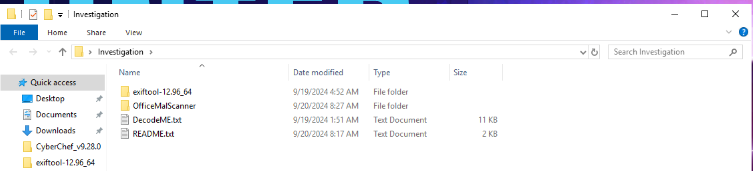
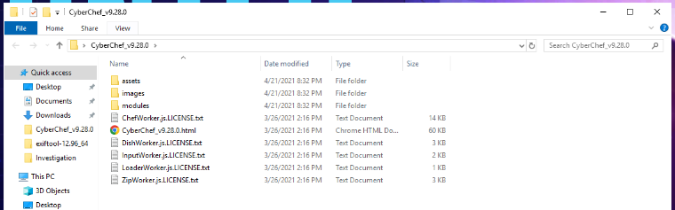

# HAUNTED

## HAUNTED scenario

> Haunted Company Inc., a long-established Credit Reporting Agency, has been successfully operating in major financial hubs such as New York, London, and Tokyo. As a privately owned entity without external investors, the company has maintained consistent client satisfaction and steady earnings reports. With plans for expansion, the management has decided to take the company public, and the Initial Public Offering (IPO) is scheduled to occur within the next few days.

> However, a crisis emerged just as the IPO date approaches. One of the company's websites has been defaced, raising alarms. Shortly after, it is discovered that the company's Tokyo server has come under attack. Concerned about the timing and the potential damage to the company’s reputation, the management is determined to identify the threat actor behind this attack and understand the breach mechanism to create detection before the IPO.

> > As a Threat Intelligence Analyst, you are tasked with collaborating with other analysts to uncover the identity of the adversary and assess the situation.

Available External and Internal Threat Intelligence:

* New York(External: Business Commonality): Report on the 2017 GenX Breach, a major cyber attack on a leading Credit Reporting Agency.
* London(Internal Intelligence: Adversary Analysis): Analysis report for Haunted Company Inc., including Asset-Threat Mapping and adversary analysis featuring FIN7, APT27, Twisted Spider, and TG-3390, all of which are known to target the finance sector.
* Tokyo(Cyber Activity Attribution): Malware analysis from the compromised server, providing critical insights into the tools used during the attack.

### Investigation Submission

Upon Launching the investigation, we are presented with two folders on the Desktop, 'Investigation and 'Cyberchef\_v9.28.0'\
 \
Curious, I opened the both DecodeMe.txt and README.txt and we begin gathering info here.

Q1) In 2017, a well-known company was attacked. What is the name of the company, its country of origin, and its business model? (Format: XxxX Xxxxxxxxx, XX, Xxxxx Xxxxxxxxx Xxxxxx) (1 points)

Q2) According to the data breach summary, one of their critical assets was compromised, and they later discovered a vulnerability in one of their public-facing applications. What type of weakness was exploited to breach their network? (Format: Axxxxxxxxxx Vxxxxxxxxxxxxx) (1 points)

Q3) How long did this breach go undetected? What was the Mean Time to Detect (MTTD)? (Format: XX days) (1 points)

Q4) What application was targeted by the attacker? What vulnerability was exploited, and where is this application located within the network? (Format: Xxxxxx Xxxxxx, CVE-XXXX-XXXX, XXXX) (1 points)

Q5) The attackers exfiltrated millions of records. How many consumer details were estimated to be exposed? How, and through which channel, was the data exfiltrated from the premises? (Format: XXX Million, xxxxxxxxx) (1 points)

Q6) Later, during the investigation, a flaw was discovered in their ACIS code rendering system. What were these flaws? (Format: XXX Xxxxxxxxx, Xxxxxxxx Xxxxxx Xxxxxx Xxxxxxxxx) (2 points)

Q7) What file was inserted during the attack, and which country did the attack originate from? (Format: XXX, Xxxxx) (2 points)

Q8) It is said that if a specific network security technique had been properly implemented, the attacker likely would have failed to accomplish their mission. What is this technique called? (Format: Nxxxxxx Sxxxxxxxxxxx) (2 points)

Q9) Adversary Analysis, this one group in particular as being involved in numerous attacks, including an attack on a medical research company during COVID-19. What is the name of this threat group (according to MITRE), what threat vector do they use, what is their country of origin, and what is their motivation? (Format: XXXX, Xxxxxxxxxx, Xxxxxx, Xxxxxxxxx) (2 points)

Q10) Investigating the other threat group. What is the APT number assigned to this group? What is the name of the specific operation that involved dropping web shells on SharePoint servers? In what year was this group first observed, and what is their possible motivation? (Format: APTXX, XxxxxXxxxx Xxxxxx Xxxxxxxxxx, XXXX, Xxxxxxxxx) (2 points)

Q11) Haunted Company Inc. in Tokyo is under cyber attack. Based on the IOCs that were provided (hint: BAT!), what attack vectors did the threat actor use? (Format: Sxxxxx Exxxxxxxxxx, Wxxxxxxx) (2 points)

Q12) One of the IOCs contains shellcode. Use a tool and review the output to identify the offset of the PEB (Process Environment Block). (Hint: Output + OSINT!) (Format: 0x..) (2 points)

Q13) Based on the intelligence gathered, which threat group was responsible for the cyberattack on Haunted Company Inc.? What is the name of the malware they used to compromise Tokyo's infrastructure? (Hint: OSINT!) (Format: Xxxxxx Xxxxx-XXXX, XxxxxXxxxxxx) (3 points)

Q14) Referring to the Asset-Threat Diagram which is an integral part of building intelligence, It appears the attacker exploited a vulnerability in Tokyo's infrastructure. What is the latest CVE for the version the threat actor targeted, and what type of attack was it? (Format: CVE-XXXX-XXXXX, XXX) (3 points)
