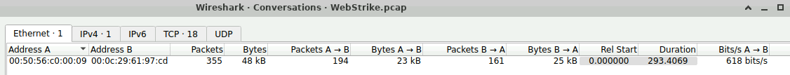
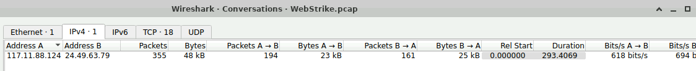
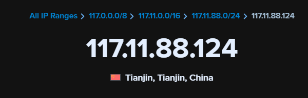
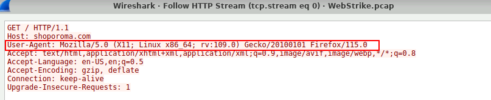
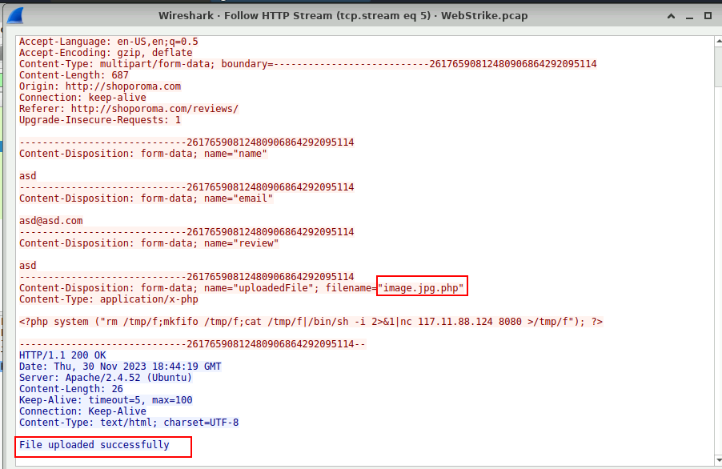
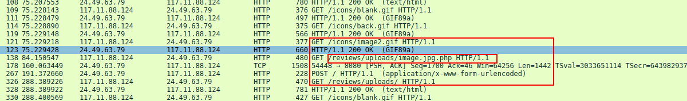
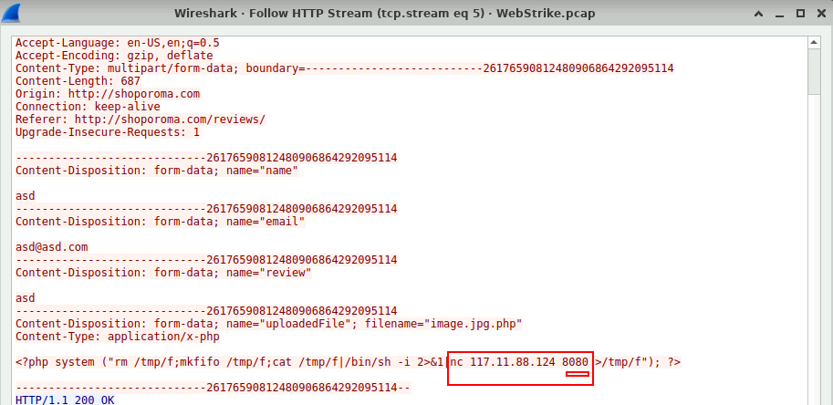
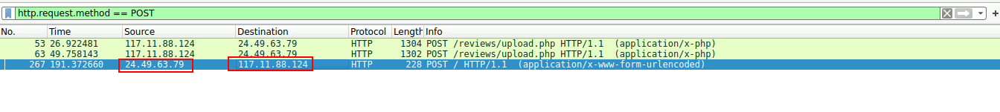
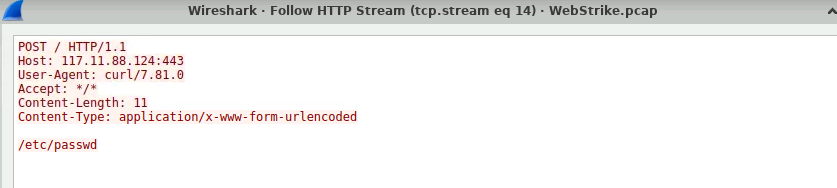

# Webstrike

### Scenario
> A suspicious file was identified on a company web server, raising alarms within the intranet. The Development team flagged the anomaly, suspecting potential malicious activity. To address the issue, the network team captured critical network traffic and prepared a PCAP file for review.
Your task is to analyze the provided PCAP file to uncover how the file appeared and determine the extent of any unauthorized activity.

### Tools
- Wireshark

#### My Approach

After accessing the environment and opening the network capture, I reviewed the file statistics and in particular, the conversations. This helped get a starting point by understanding how many parties were involved here.
  
  
Having both the Mac and IP Addresses of the source and destinations users. I went on to attempt the questions.  

### Questions
Q1: Identifying the geographical origin of the attack helps in implementing geo-blocking measures and analyzing threat intelligence. From which city did the attack originate?

To get the geographical origin, I used the IP. On ipinfo.io, I performed a lookup.  

Q2: Knowing the attacker's User-Agent assists in creating robust filtering rules. What's the attacker's User-Agent?

Inorder to get the User Agent, I needed to analyze the web traffic. For this, I followed the HTTP stream i.e `tcp.stream eq 0`

Q3: We need to determine if any vulnerabilities were exploited. What is the name of the malicious web shell that was successfully uploaded?

The key term here to guide me was 'successfully uploaded' meaning, I needed to evaluate the POST request. Having seen that the communication to the web server was through port 80, I used the display filter `http.request.method == POST`  
This gives us three packets to analyze. The first one attempted to upload a reverse shell payload but was unsuccessful. I need the successful one.

Q4: Identifying the directory where uploaded files are stored is crucial for locating the vulnerable page and removing any malicious files. Which directory is used by the website to store the uploaded files?

By analyzing the http requests, it was easy to spot the directory of the uploaded files.

Q5: Which port, opened on the attacker's machine, was targeted by the malicious web shell for establishing unauthorized outbound communication? (Please enter a numeric answer.)

To get this, I analyzed the content of the successful POST request. It included a netcat command with the port.

Q6: Recognizing the significance of compromised data helps prioritize incident response actions. Which file was the attacker attempting to exfiltrate?

Having known the successful POST request, analyzing it's response tells us what file the attacker wanted.

The `/etc/passwd/` file must have been the first goal for the attacker. This file contains the password hashes for all the users. Having this, the attacker's next move would definitely be privilege escalation.

