# WireDive

### Questions

What is the path of the file that is opened?

I used the display filter `smb2` and then analyzed the issued SMB commands and their responses.
As seen in the below screenshot, the attacker queried to see the files present and there was only one.

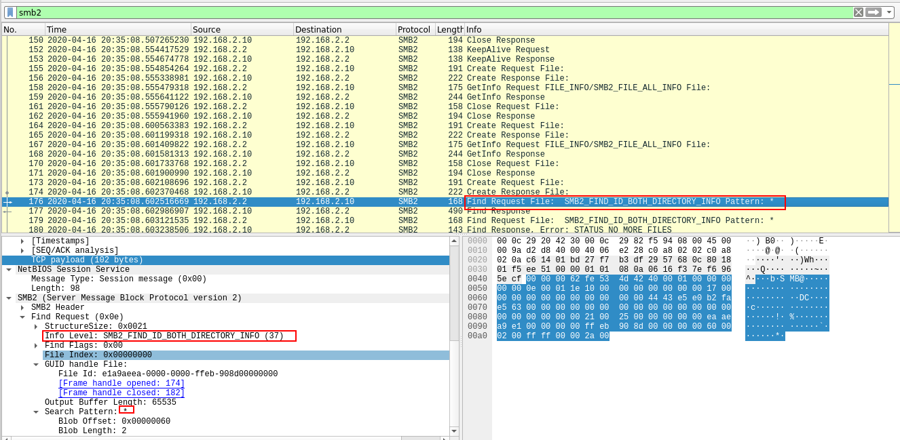

The following packet was the response to the request. We can see that there was only one file which was a directory.

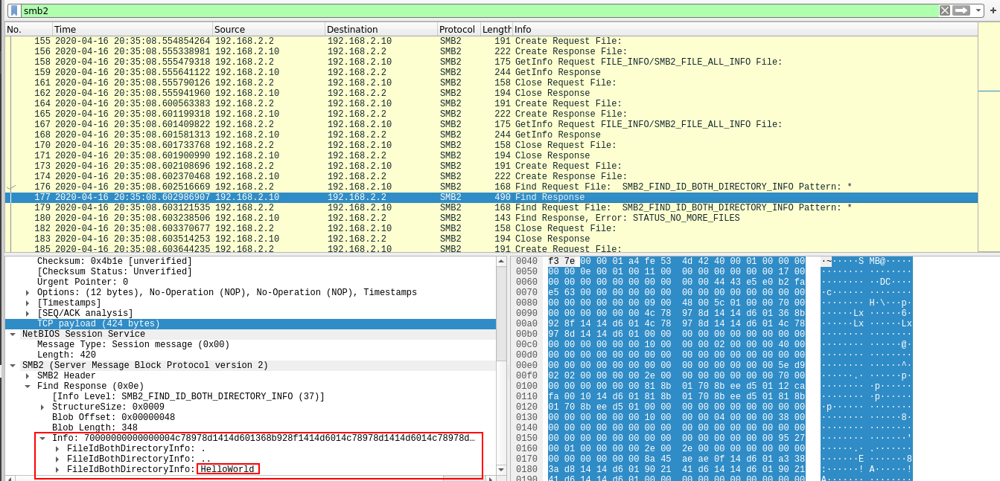
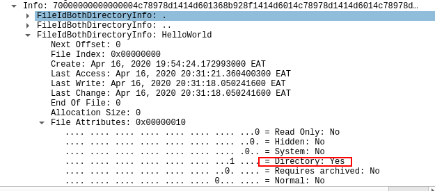

Further queries show that only one text file existed in the found directory.

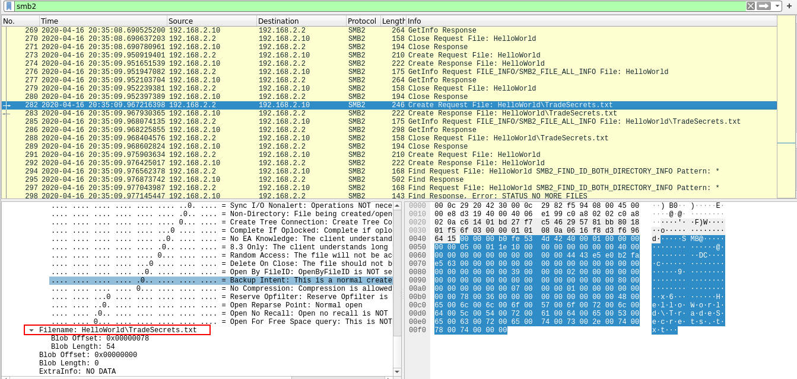

What was the hex status code when the user SAMBA\jtomato logs in?

To answer this, I needed to analyze the session setup packets. I found the particular point when the session for the user in question was setup.

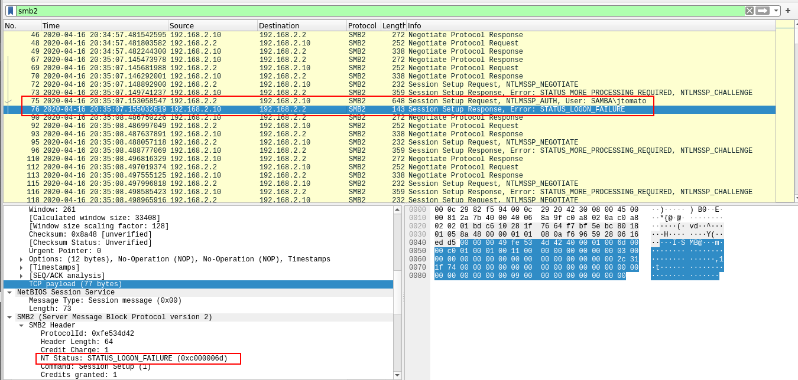

As we can see, this was not successful and the status code can be found in the SMB2 Header.

What is the tree that is being browsed?

We can see this in the Tree Connect Request

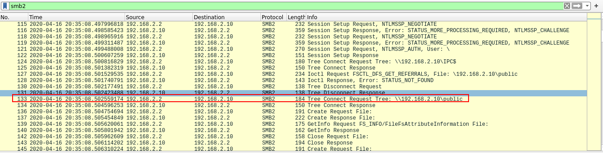

What is the flag in the file?

I analyzed the Read Request and Response. I discovered that there was a long message in the discovered file. To easily see the content and retrieve the flag, I followed the TCP stream of the response. In the 'Find' box, I entered flag and found it.

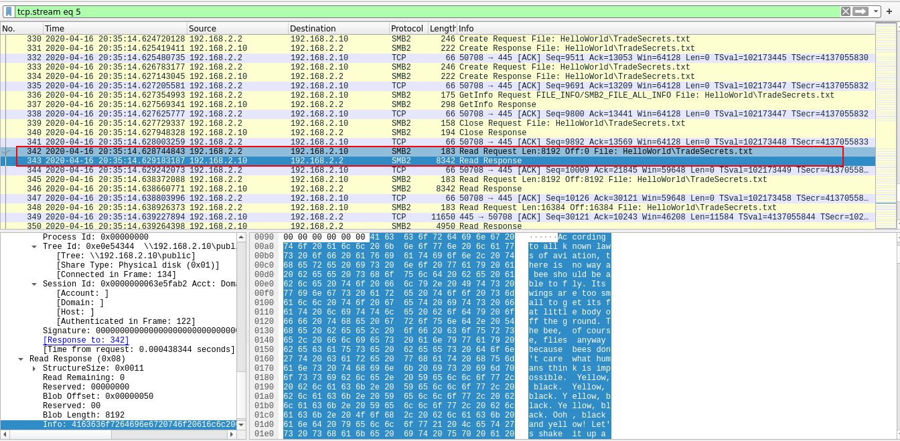

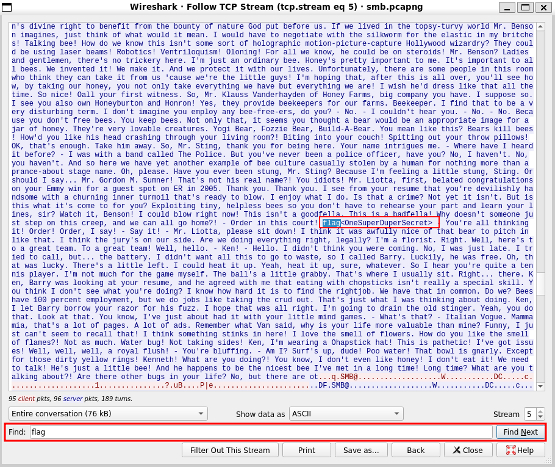

Q10
Solved : 1746

What port is the shell listening on?

Just after opening the pcap file, it is evident through the 3-way TCP handshake what port the shell/server was listening on.

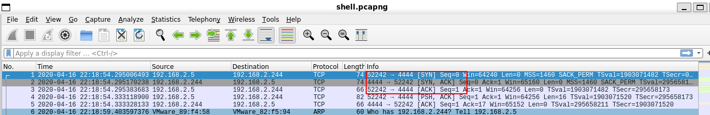

**What is the port for the second shell?**

Following the TCP stream of the first discovered shell, I discovered that the attacker attempted a reverse shell which was successful.

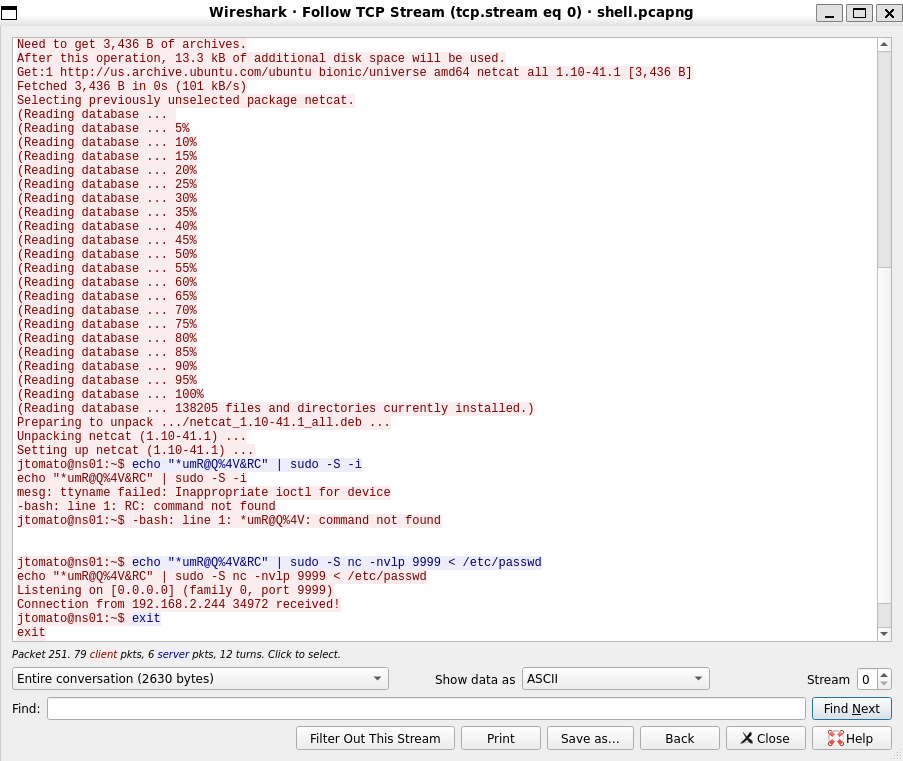

What version of netcat is installed?

From the above reverse shell, we can see the Netcat version from the installed packages.

**What file is added to the second shell**

Also from the reverse shell, I saw that the attacker added the file /etc/passwd using the redirection method

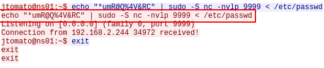

What password is used to elevate the shell?

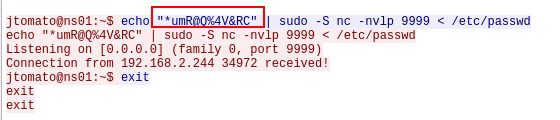

What is the codename of the target system's OS version?

The hint here is that the codename starts with letter b. Looking around, we can see this is the `apt update` command issued by the attacker.

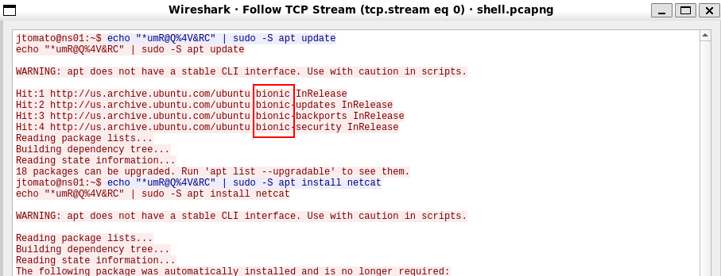

How many users are on the target system?

By following the second reverse shell TCP stream, I saw the content of the `/etc/passwd` file which has all the users.

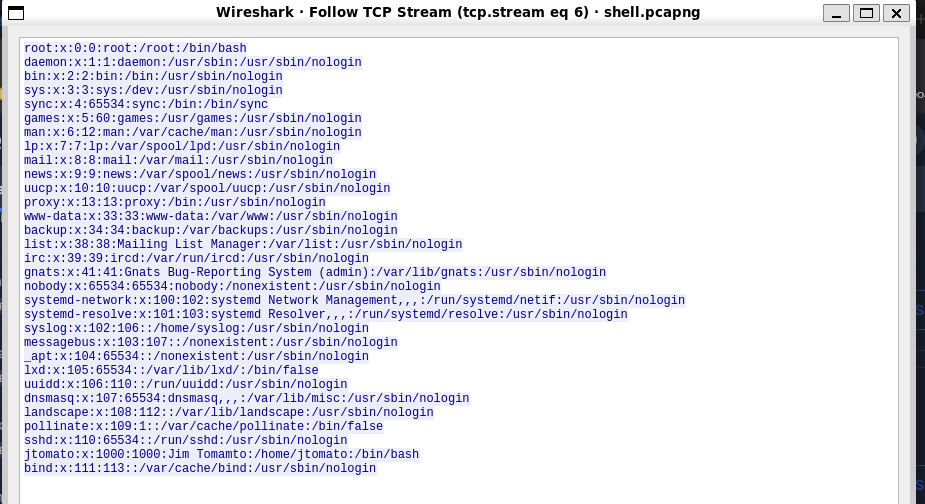