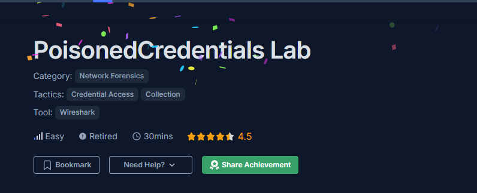
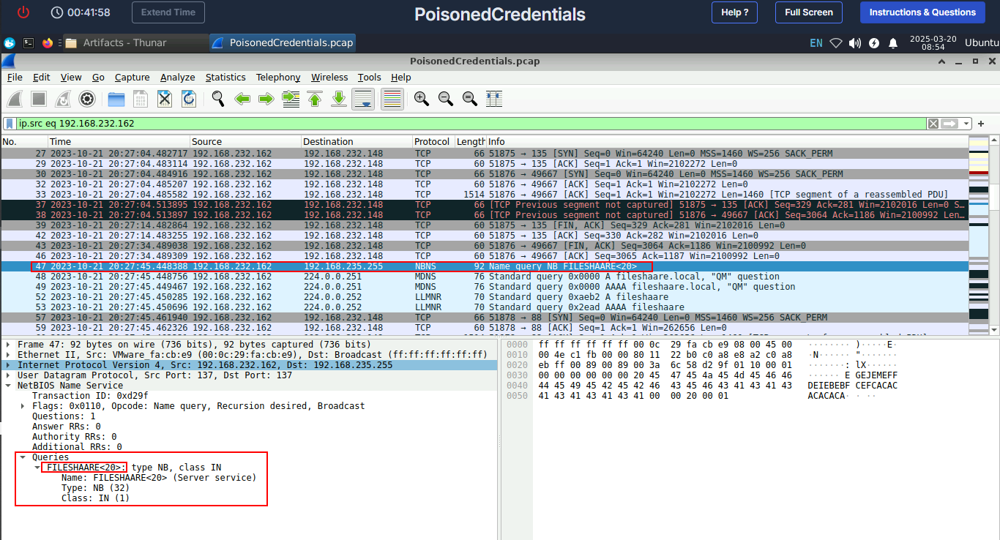
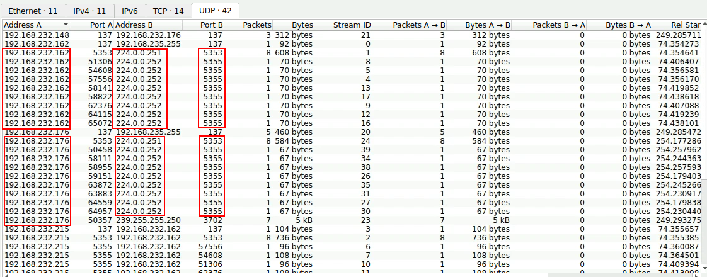
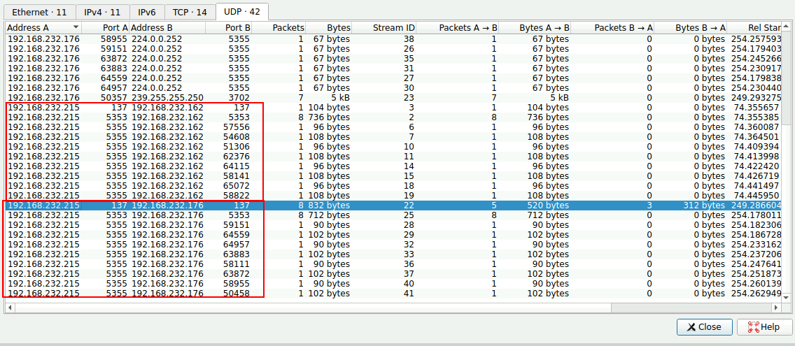
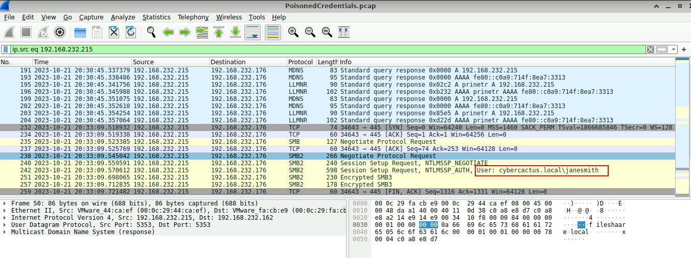
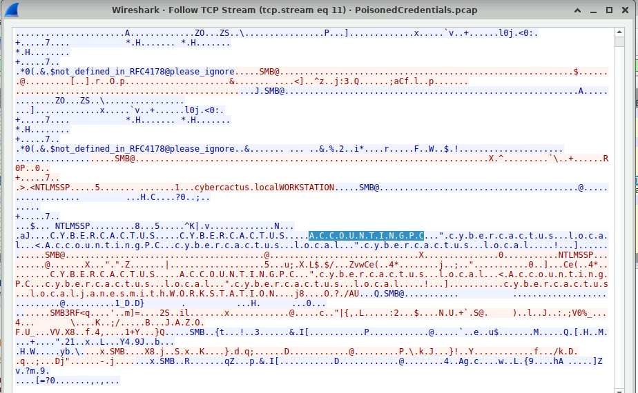

# Poisoned Credentials

## Scenario

> Your organization's security team has detected a surge in suspicious network activity. There are concerns that LLMNR (Link-Local Multicast Name Resolution) and NBT-NS (NetBIOS Name Service) poisoning attacks may be occurring within your network. These attacks are known for exploiting these protocols to intercept network traffic and potentially compromise user credentials. Your task is to investigate the network logs and examine captured network traffic.

### Tools
- Wireshark

### Questions

Q1. **In the context of the incident described in the scenario, the attacker initiated their actions by taking advantage of benign network traffic from legitimate machines. Can you identify the specific mistyped query made by the machine with the IP address 192.168.232.162?**

First, I used the display filter `ip.src` to filter for traffic originating from the given IP. While gaining gaining an understanding of the communication flow, I encountered a Netbios Name query. However, there was a typo. 

Q2. **We are investigating a network security incident. To conduct a thorough investigation, We need to determine the IP address of the rogue machine. What is the IP address of the machine acting as the rogue entity?**

To identify, the rogue entity, I needed to understand how many entities were communicating in the network. I reviewed the conversations and specifically the UDP traffic. Why UDP? Because I know when traversing the firewalls, TCP might not be the best option and so UDP is preferred by threat actors.

From the above images, traffic to port 5355 indicates broadcast and multicast requests ideally to discover hosts. However, in the second image, we see traffic likely belonging to a host communicating to two different hosts. Through this, I figured out the rogue entity

Q3. **As part of our investigation, identifying all affected machines is essential. What is the IP address of the second machine that received poisoned responses from the rogue machine?**

From the conversations window above, we can see IP addresses that the rogue entity communicated to.

Q4. **We suspect that user accounts may have been compromised. To assess this, we must determine the username associated with the compromised account. What is the username of the account that the attacker compromised?**

Since I already know the rogue entity, analyzing its traffic will definitely disclose the compromised account.

Q5. **As part of our investigation, we aim to understand the extent of the attacker's activities. What is the hostname of the machine that the attacker accessed via SMB?**

## Summary 

This lab sharpened my network analysis skills. In particular, how to detect poisoning attacks targeting LLMNR - Link Local Multicast Name Resolution and NBT-NS - Netbios Name Service protocols. These protocols rely on broadcast queries and lack robust authentication and hence a prime target for network attacks.