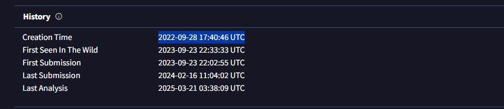
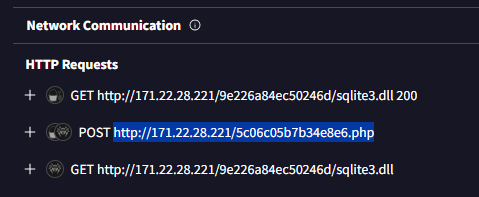
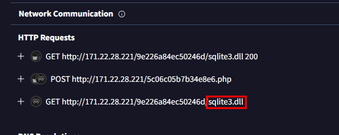
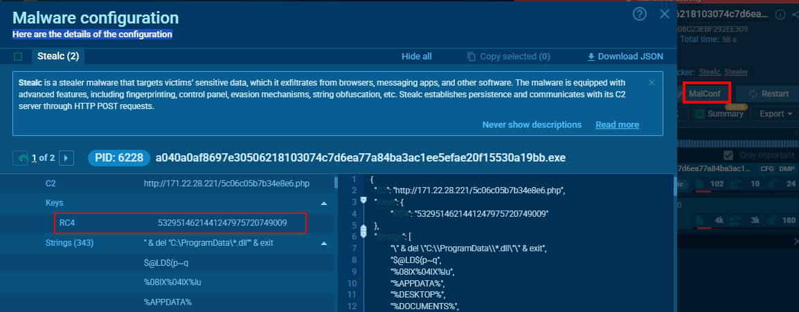
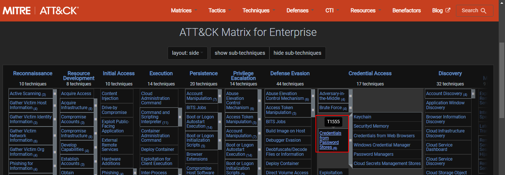
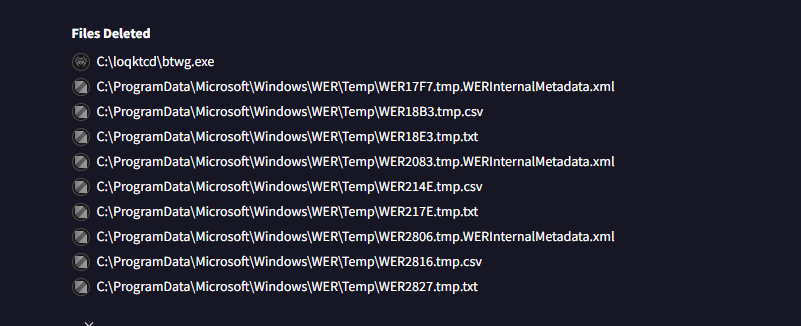

# OSKI  

## Scenario
> The accountant at the company received an email titled "Urgent New Order" from a client late in the afternoon. When he attempted to access the attached invoice, he discovered it contained false order information. Subsequently, the SIEM solution generated an alert regarding downloading a potentially malicious file. Upon initial investigation, it was found that the PPT file might be responsible for this download. Could you please conduct a detailed examination of this file?

### Questions
Q1. Determining the creation time of the malware can provide insights into its origin. What was the time of malware creation?

*To determine the creation time, I utilized VirusTotal. After extracting the provided file, there was a text file with an MD5 hash. Searching the VirusTotal DB using the MD5 hash gives us the creation details on the History section*

Q2. Identifying the command and control (C2) server that the malware communicates with can help trace back to the attacker. Which C2 server does the malware in the PPT file communicate with?

To identify the C2 server, I reviewed the behaviour of the malware and in particular, the `http requests`. 

Q3. Identifying the initial actions of the malware post-infection can provide insights into its primary objectives. What is the first library that the malware requests post-infection?

We can also retrieve this from the `http requests` section.

Q4. Upon examining the malware, it appears to utilize the RC4 key for decrypting a base64 string. What specific RC4 key does this malware use?

To answer this, I need to review the malware configuration. Using the SHA256, I researched for a report in `any.run`.

Q5. Identifying an adversary's techniques can aid in understanding their methods and devising countermeasures. Which MITRE ATT&CK technique are they employing to steal a user's password?

From the MITRE ATT&CK map, the technique used to steal user's password is;

Q6. Malware may delete files left behind by the actions of their intrusion activity.Which directory or path does the malware target for deletion?

Info about targeted deletions can be found on VirusTotal. Here, we see the massive deletions from the `ProgramData` directory.

Q7. Understanding the malware's behavior post-data exfiltration can give insights into its evasion techniques. After successfully exfiltrating the user's data, how many seconds does it take for the malware to self-delete?

