# Windows Fundamentals

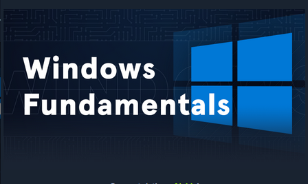

### Introduction

Windows is one of the most used operating system. Therefore, it is very crucial for a security analyst to have a deeper understanding of the operating system. This module, covers the Windows fundamental concepts. Starting from the introduction, the module dives deeper into the Windows Operating system structure, The Windows file system, Permissions management, Windows services, Processes in Windows, Windows Task Manager, Interacting with the operating system, Windows security, The Microsoft Management Console (MMC), and Windows Subsystem for Linux (WSL).

In the introduction section, we learn how to use Get-WMIObject cmdlet to find information about the OS. We also learn local and remote access to a windows machine using the RDP protocol.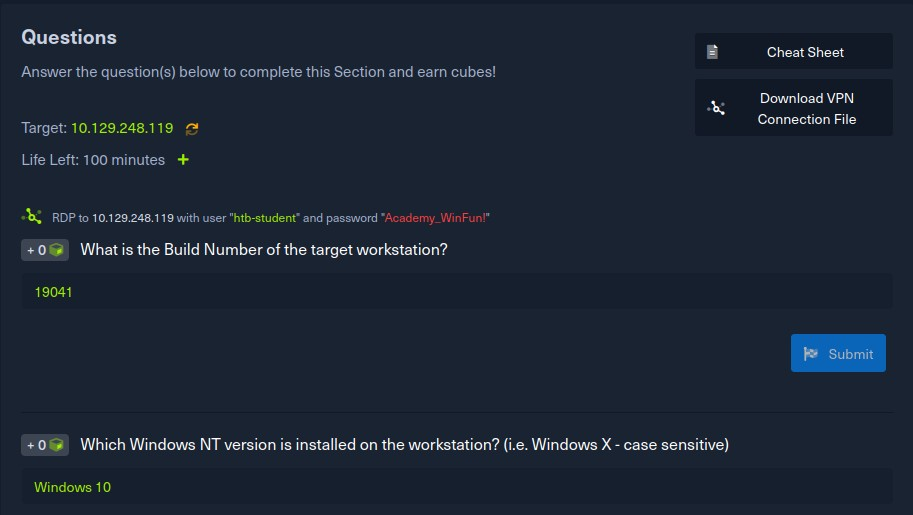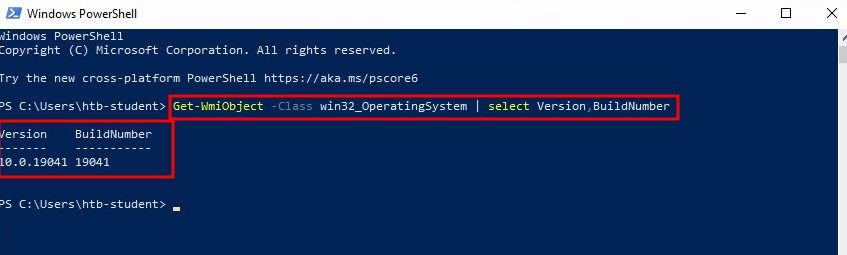

command line utility using the dir and tr ee commands. The question tests on the concept.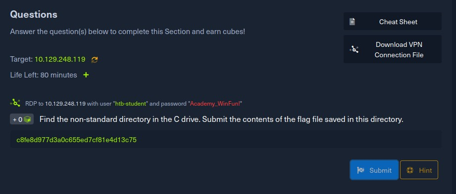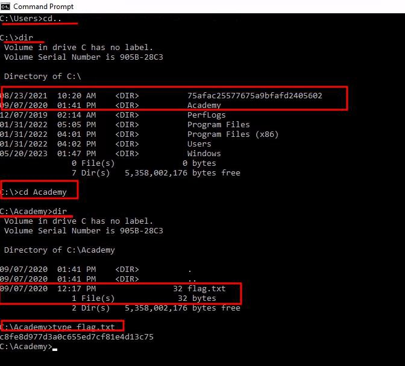

We also learn of the _icacls_ command which can be used to list the NTFS permissions on a specific directory. In the question, we are tested on this.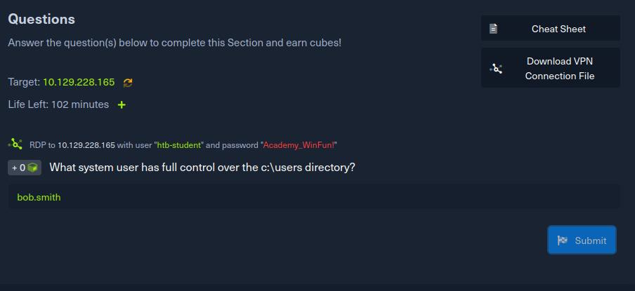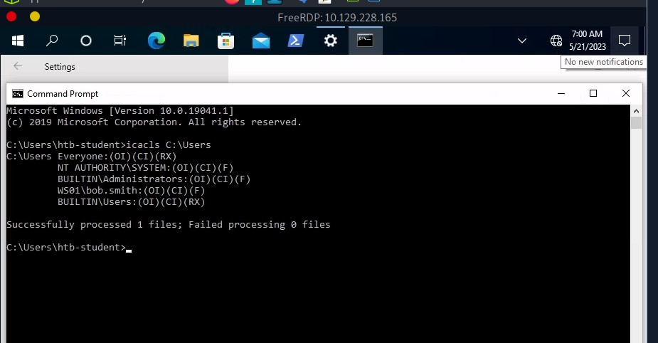

Permissions can be either NTFS or share. Share permissions apply when accessing a shared folder using the SMB protocol. Here, we learn about creating network shares and the related permissions

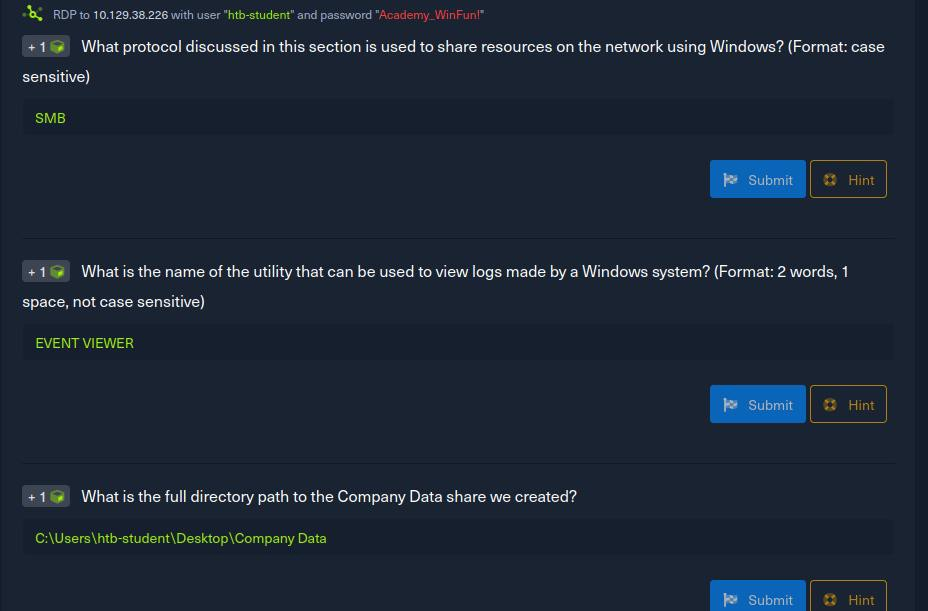

Services is another great part covered in this module. We get to learn how to view running services as well as processes using the services.msc command. Moreover, we learn about the sysinternal tools which are useful in administering Windows system.

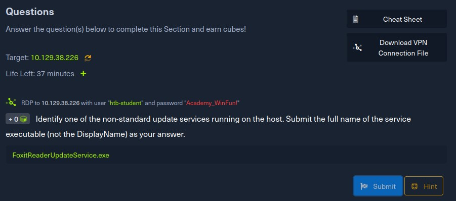  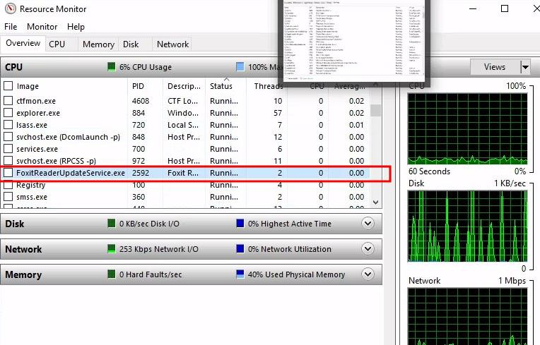

To interact with the windows os, we can utilize the GUI, RDP and Windows command line which entails CMD and Powershell. An understanding of the aliases is of great importance especially during running scripts.

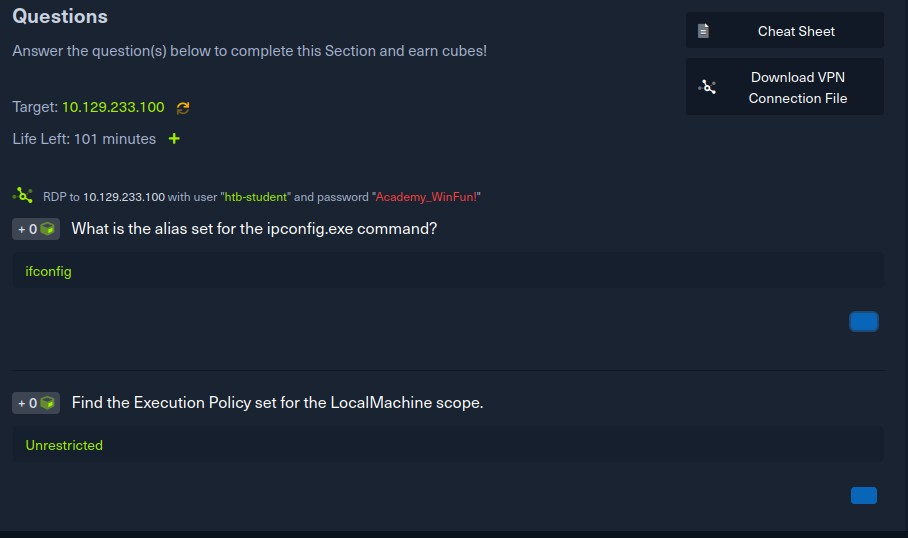 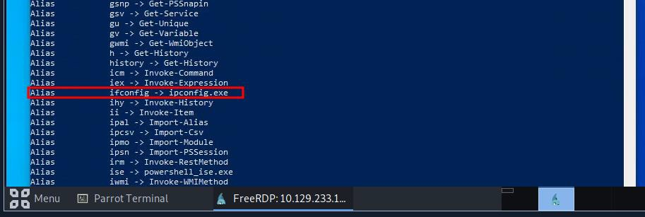 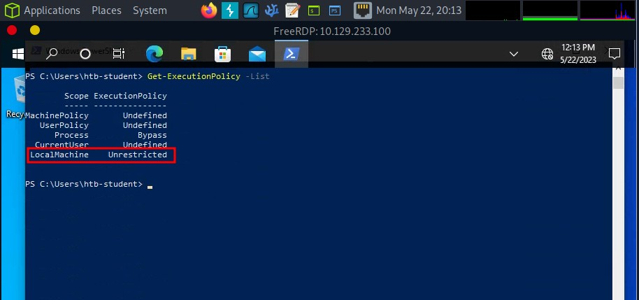

The next part covers the Windows Management Instrumentation which provides system admins tools for system monitoring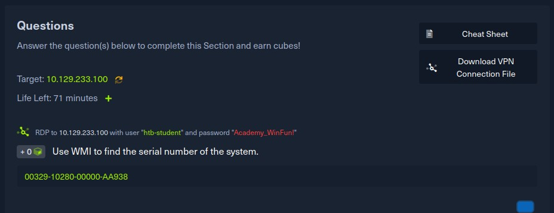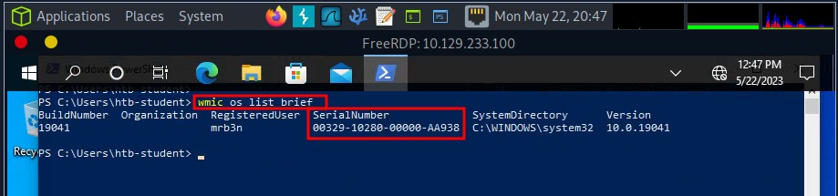

Next we learn about the windows security and Security Identifiers. Under the Security Accounts Manager and Access Control Entries we learn about the User Access Control and the registry

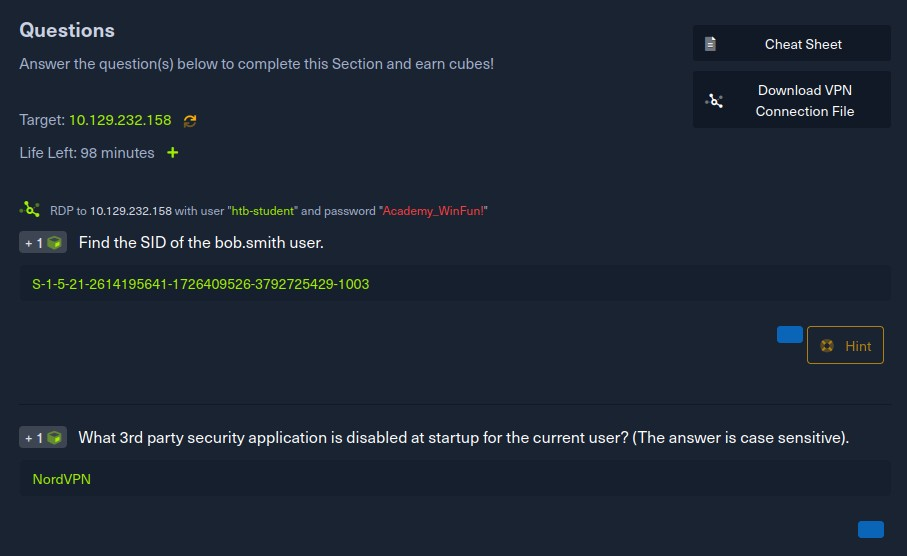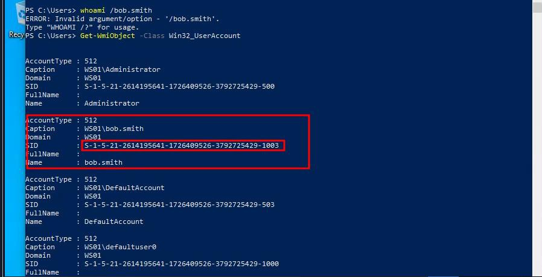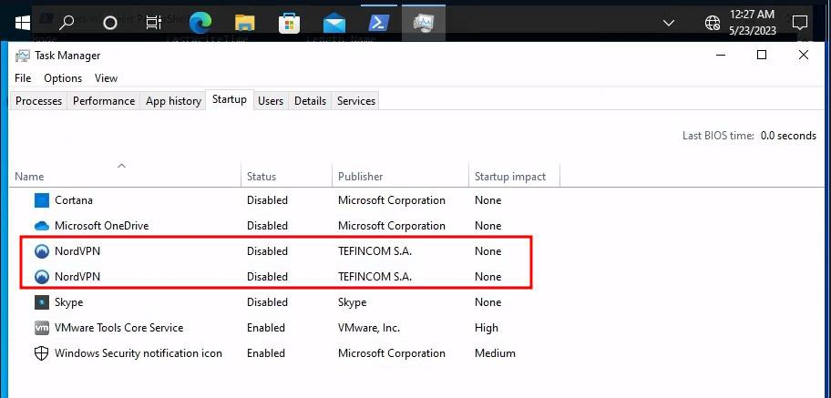\
The module ends with a skills assessment. Here a case scenario is provided coupled with some tasks among them being, creating a shared folder, creating a user, creating a security group, adding the user to the security group and modifying the NTFS and Share permissions. These tasks help in answering the following questions.

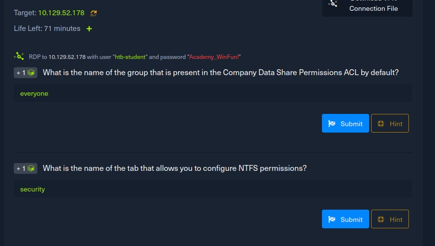 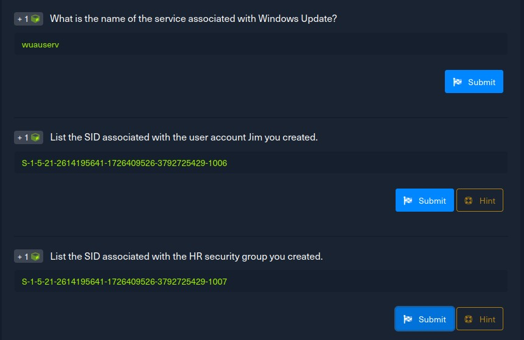 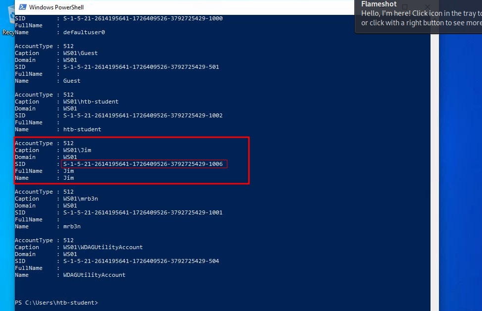 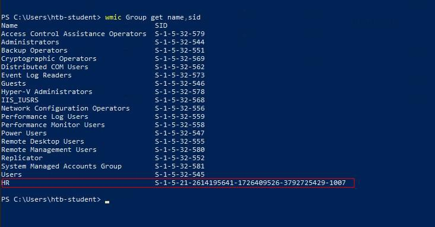

Conclusion:

This module covers the essentials for working with the Windows operating system. Though extensive, a lot of reading and research will help master and have the concepts at fingertips. I thought I knew the Windows OS well but this module proved otherwise. However, I learnt and gained new concepts such as interacting with the OS using the command line utilities.

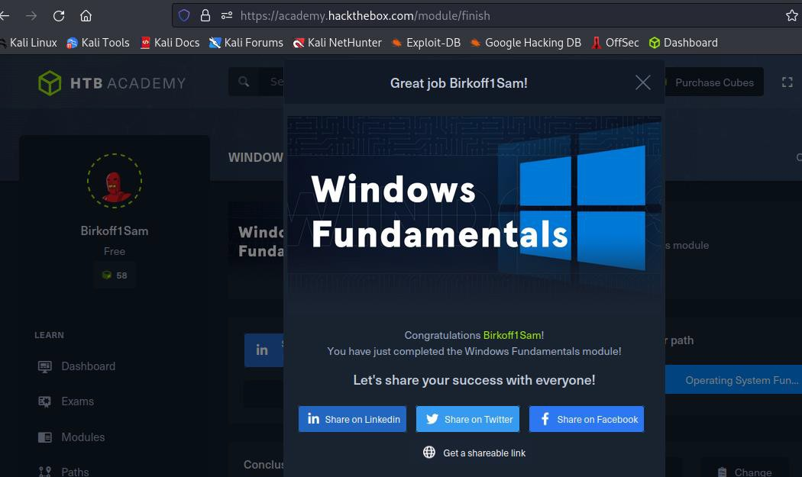\
To view my achievement, follow:>> https://academy.hackthebox.com/achievement/388358/49
