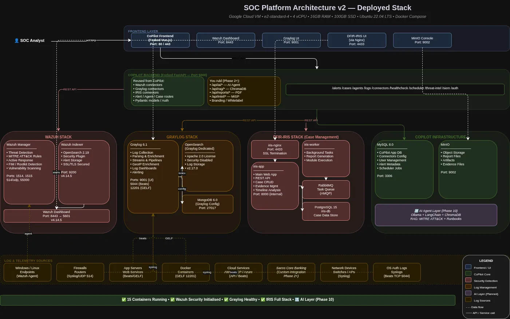

# SOCHub

> **A Complete Technical Guide**\
> Wazuh • Graylog • CoPilot • DFIR-IRIS • Docker Compose • GCP • OpenSearch\
> &#xNAN;_&#x4D;ay 2026_

## 1. Introduction & Objectives

This document chronicles the full build-out of a self-hosted Security Operations Centre (SOC) platform on Google Cloud Platform (GCP). The goal was to create a production-grade, open-source SOC stack that replicates enterprise capabilities without vendor lock-in or licensing costs.

**What is up during the time of this writeup(June 2026)**

A unified security monitoring and incident response platform integrating four major open-source tools:

* Wazuh — SIEM, threat detection, file integrity monitoring, and agent-based endpoint telemetry
* Graylog — centralised log management, parsing, and alerting
* SOCFortress CoPilot — unified SOC dashboard connecting all tools with automation and case management
* DFIR-IRIS — digital forensics and incident response case management platform


All tools in this stack are open-source and self-hosted. No data leaves your infrastructure.


## 2. Architecture Overview

The platform runs entirely within Docker containers on a single Ubuntu VM, connected via a shared Docker bridge network called `soc-network`.&#x20;

Each service communicates using Docker DNS (container hostnames) rather than IP addresses, making the setup portable.

**High-Level Architecture**

<figure><figcaption></figcaption></figure>

| Layer               | Components                                                                                                             |
| ------------------- | ---------------------------------------------------------------------------------------------------------------------- |
| Endpoint Telemetry  | Wazuh Manager + Wazuh Agents (deployed on monitored hosts)                                                             |
| Log Indexing        | Wazuh Indexer (OpenSearch) — stores Wazuh alerts and events                                                            |
| Log Management      | Graylog + dedicated OpenSearch instance — ingests syslog, GELF, Beats                                                  |
| Visualisation       | Wazuh Dashboard (OpenSearch Dashboards) — Wazuh-native UI                                                              |
| SOC Operations      | CoPilot — unified dashboard, connector hub, and automation engine                                                      |
| Case Management     | DFIR-IRIS — structured incident investigation and case tracking                                                        |
| Supporting Services | MySQL (CoPilot DB), MinIO (object storage), MongoDB (Graylog config), PostgreSQL (IRIS DB), RabbitMQ (IRIS task queue) |

### Network Design

All 15 containers share a single Docker bridge network (`soc-network`). Services reference each other by hostname, e.g., the CoPilot backend connects to MySQL at `copilot-mysql:3306` and to Wazuh Indexer at `wazuh-indexer:9200`. No service-to-service traffic leaves the VM.

### Key Design Decisions

* Graylog gets its own dedicated OpenSearch instance (`opensearch-graylog`) rather than sharing Wazuh's indexer, because Wazuh Indexer requires SSL/TLS while Graylog's OpenSearch connection expects plain HTTP.
* MinIO is remapped from port 9000 to 9002 externally to avoid conflict with Graylog's internal port 9000.
* Wazuh Dashboard is exposed on port 8443 rather than the default 443, since CoPilot's frontend already owns port 443.
* IRIS runs as 5 containers (app, worker, nginx, db, rabbitmq) — its architecture requires a message broker for background task processing.

## 3. Infrastructure: VM Setup

### VM Specifications

| Parameter    | Value                                           |
| ------------ | ----------------------------------------------- |
| Provider     | Google Cloud Platform (GCP)                     |
| Machine Type | e2-standard-4 or equivalent (4 vCPU, 16 GB RAM) |
| OS           | Ubuntu 24.04 LTS                                |
| Disk         | 50 GB SSD (minimum recommended)                 |
| RAM          | 16 GB (14 GB available at deployment time)      |
| Swap         | 4 GB                                            |

### GCP Firewall Rules

The following inbound TCP ports must be opened in GCP VPC Network → Firewall:

| Port    | Service                                      |
| ------- | -------------------------------------------- |
| 80      | CoPilot Frontend (HTTP → redirects to HTTPS) |
| 443     | CoPilot Frontend (HTTPS)                     |
| 4433    | DFIR-IRIS (HTTPS)                            |
| 8443    | Wazuh Dashboard (HTTPS)                      |
| 9001    | Graylog Web UI (HTTP)                        |
| 1514    | Wazuh Agent communication (TCP)              |
| 1515    | Wazuh Agent registration (TCP)               |
| 514/udp | Wazuh Syslog input                           |
| 55000   | Wazuh API (internal use by CoPilot)          |
| 12201   | Graylog GELF input (TCP/UDP)                 |


Ports 1514, 1515, 514, 55000, and 12201 only need to be open if you are enrolling external agents or sending logs from outside the VM.


### Installation

I installed Docker Engine and Docker Compose v2 on the VM. \
I also added the user to the docker group to run commands without sudo.

```bash
# Install Docker Engine
curl -fsSL https://get.docker.com | sh

# Add user to docker group
sudo usermod -aG docker $USER
newgrp docker

# Verify
docker --version
docker compose version
```

## 4. Stack Components Deep Dive

### 4.1 SOCFortress CoPilot

CoPilot is the central hub of the platform. It is an open-source SOC dashboard built by SOCFortress that connects to Wazuh, Graylog, IRIS, and other tools via a connector system. It provides:

* A unified web UI for SOC analysts
* Connector management for all integrated tools
* Alert ingestion and case creation workflows
* Agent management and deployment
* Scheduled jobs for index management and alert sync

CoPilot is composed of three containers:

* `copilot-backend` — FastAPI Python application on port 5000
* `copilot-frontend` — Vue.js/Nginx web UI on ports 80/443
* `copilot-mysql` — MySQL 8 database storing all CoPilot configuration and data


CoPilot also supports MinIO for object/file storage (reports, uploads). MinIO runs on internal port 9000, remapped to 9002 externally.


### 4.2 Wazuh (SIEM & Endpoint Security)

Wazuh is an open-source security platform providing threat detection, integrity monitoring, incident response, and compliance. Version 4.14.5 was deployed (the latest stable release at time of writing).

The Wazuh stack comprises three containers:

* `wazuh-manager` — the core Wazuh server. Receives agent data, applies rules, generates alerts. Exposes the REST API on port 55000.
* `wazuh-indexer` — an OpenSearch 2.x instance customised for Wazuh. Stores all alerts and events. Requires SSL/TLS and security plugin initialisation via `securityadmin.sh`.
* `wazuh-dashboard` — an OpenSearch Dashboards instance with the Wazuh plugin pre-installed. Exposed on port 8443.

#### Wazuh SSL Certificates

Wazuh requires mutual TLS between its components. Certificates are generated using the official `wazuh-certs-tool.sh` script. The `config.yml` passed to the tool defines three nodes (indexer, manager, dashboard) using IP `127.0.0.1` rather than Docker hostnames, because certificate signing happens outside the Docker network.

#### Security Plugin Initialisation

On first boot, Wazuh Indexer's OpenSearch security plugin must be bootstrapped manually using the `securityadmin.sh` tool inside the container. This populates the `.opendistro_security` index with roles, users, and policy configuration.

```bash
docker exec -it copilot-wazuh-indexer-1 bash -c "
export JAVA_HOME=/usr/share/wazuh-indexer/jdk && \
/usr/share/wazuh-indexer/plugins/opensearch-security/tools/securityadmin.sh \
-cd /usr/share/wazuh-indexer/config/opensearch-security/ \
-p 9200 -cn wazuh-indexer -h wazuh-indexer -nhnv \
-cacert /usr/share/wazuh-indexer/config/certs/root-ca.pem \
-cert /usr/share/wazuh-indexer/config/certs/admin.pem \
-key /usr/share/wazuh-indexer/config/certs/admin-key.pem
"
```

### 4.3 Graylog (Log Management)

Graylog 6.1 provides centralised log collection, parsing, and alerting. It ingests logs from multiple sources including syslog, GELF (Graylog Extended Log Format), and Beats.

The Graylog stack comprises three containers:

* `graylog` — the main Graylog server on port 9001 (moved from default 9000 to avoid MinIO conflict)
* `mongodb` — MongoDB 6.0 storing Graylog's configuration, streams, and dashboards
* `opensearch-graylog` — a dedicated OpenSearch 2.17 instance (security disabled) for Graylog's message storage


Graylog cannot share Wazuh's OpenSearch instance because Wazuh Indexer enforces SSL/TLS, while Graylog's Elasticsearch/OpenSearch connection expects plain HTTP on this setup.


### 4.4 DFIR-IRIS (Case Management)

DFIR-IRIS v2.4.19 is a collaborative digital forensics and incident response platform. It provides structured case management with timelines, IOC tracking, evidence management, and reporting.

IRIS runs as five containers:

* `iris-app` — the main Flask/Python web application on internal port 8000
* `iris-worker` — Celery worker for background tasks (report generation, module execution)
* `iris-nginx` — nginx reverse proxy handling SSL termination, exposed on port 4433
* `iris-db` — PostgreSQL 12 database (using the official `iriswebapp_db` image)
* `iris-rabbitmq` — RabbitMQ message broker for task queuing between app and worker

#### IRIS Database Notes

Two important database requirements discovered during deployment:

* The `pgcrypto` PostgreSQL extension must be enabled (required for `gen_random_uuid()` function used in schema migrations)
* The `iris_admin` database user must have SUPERUSER privileges to run Alembic schema migrations on tables initially created by the `iris` user

## 5. Docker Compose Configuration

All 15 services are defined in a single `docker-compose.yml` file. The complete service manifest is:

| Service              | Port(s)             | Image                                         | Purpose                          |
| -------------------- | ------------------- | --------------------------------------------- | -------------------------------- |
| `copilot-backend`    | 5000                | `ghcr.io/socfortress/copilot-backend:latest`  | CoPilot API server (FastAPI)     |
| `copilot-frontend`   | 80, 443             | `ghcr.io/socfortress/copilot-frontend:latest` | CoPilot web UI (Vue + Nginx)     |
| `copilot-mysql`      | 3306                | `mysql:8.0.46-debian`                         | CoPilot relational database      |
| `copilot-minio`      | 9002:9000           | `ghcr.io/socfortress/minio:\...`              | Object/file storage for CoPilot  |
| `wazuh-manager`      | 1514,1515,514,55000 | `wazuh/wazuh-manager:4.14.5`                  | Wazuh server and API             |
| `wazuh-indexer`      | 9200                | `wazuh/wazuh-indexer:4.14.5`                  | OpenSearch for Wazuh alerts      |
| `wazuh-dashboard`    | 8443:5601           | `wazuh/wazuh-dashboard:4.14.5`                | Wazuh/OpenSearch Dashboards UI   |
| `opensearch-graylog` | (internal)          | `opensearchproject/opensearch:2.17.0`         | Dedicated OpenSearch for Graylog |
| `mongodb`            | (internal)          | `mongo:6.0`                                   | Graylog config store             |
| `graylog`            | 9001,5044,12201     | `graylog/graylog:6.1`                         | Log management platform          |
| `iris-db`            | (internal)          | `ghcr.io/dfir-iris/iriswebapp_db:v2.4.19`     | IRIS PostgreSQL database         |
| `iris-rabbitmq`      | (internal)          | `rabbitmq:3-management-alpine`                | IRIS task queue broker           |
| `iris-app`           | (internal)          | `ghcr.io/dfir-iris/iriswebapp_app:v2.4.19`    | IRIS web application             |
| `iris-worker`        | (internal)          | `ghcr.io/dfir-iris/iriswebapp_app:v2.4.19`    | IRIS Celery task worker          |
| `iris-nginx`         | 4433                | `ghcr.io/dfir-iris/iriswebapp_nginx:v2.4.19`  | IRIS SSL reverse proxy           |

### Volume Strategy

Named Docker volumes are used for all persistent data to survive container restarts and upgrades:

* `mysql-data` — CoPilot's MySQL database files
* `wazuh-indexer-data` — Wazuh OpenSearch indices (alert data)
* `wazuh-etc`, `wazuh-logs`, `wazuh-queue`, etc. — Wazuh Manager configuration and logs
* `mongodb-data` — Graylog's MongoDB configuration store
* `opensearch-graylog-data` — Graylog's log message storage
* `graylog-data` — Graylog journal and plugin data
* `iris-db-data` — IRIS PostgreSQL database files
* `iris-downloads`, `iris-user-templates`, `iris-server-data` — IRIS application data

### Memory Allocation

Java heap sizes were capped to prevent OOM on the 16 GB VM:

| Service              | JVM Heap Setting  |
| -------------------- | ----------------- |
| `wazuh-indexer`      | `-Xms1g -Xmx2g`   |
| `opensearch-graylog` | `-Xms512m -Xmx1g` |
| `graylog`            | `-Xms512m -Xmx1g` |

## 6. SSL Certificate Generation

### Wazuh Certificates

Wazuh requires mutual TLS between its three components. Certificates are generated using the official `wazuh-certs-tool.sh` script provided by Wazuh at `packages.wazuh.com`.

**config.yml for Certificate Generation**

```yaml
nodes:
  indexer:
    - name: wazuh-indexer
      ip: 127.0.0.1
  server:
    - name: wazuh-manager
      ip: 127.0.0.1
  dashboard:
    - name: wazuh-dashboard
      ip: 127.0.0.1
```


IP `127.0.0.1` is used instead of Docker hostnames because the certificate tool runs on the host, not inside Docker. Docker hostname resolution only works within the `soc-network` at runtime.


The tool generates the following certificate files in `./wazuh-certificates/`:

* `root-ca.pem` / `root-ca.key` — Certificate Authority
* `admin.pem` / `admin-key.pem` — Used by `securityadmin.sh` for security initialisation
* `wazuh-indexer.pem` / `wazuh-indexer-key.pem` — Indexer TLS cert
* `wazuh-manager.pem` / `wazuh-manager-key.pem` — Manager TLS cert
* `wazuh-dashboard.pem` / `wazuh-dashboard-key.pem` — Dashboard TLS cert

### IRIS Certificates

IRIS requires self-signed certificates for its nginx reverse proxy. These are generated using OpenSSL:

```bash
# Generate root CA
openssl genrsa -out certificates/rootCA/irisRootCAKey.pem 4096
openssl req -x509 -new -nodes -key irisRootCAKey.pem -sha256 -days 3650 \
  -subj "/CN=irisRootCA" -out irisRootCACert.pem

# Generate web certificate signed by root CA
openssl genrsa -out certificates/web_certificates/iris.key 2048
openssl req -new -key iris.key -subj "/CN=iris" -out iris.csr
openssl x509 -req -days 3650 -in iris.csr -CA irisRootCACert.pem \
  -CAkey irisRootCAKey.pem -CAcreateserial -out iris.crt

# Critical: set read permissions for nginx
chmod 644 iris.key iris.crt
```

## 7. Environment Configuration (`.env`)

All secrets and service URLs are stored in a `.env` file in the CoPilot project directory. Secrets were generated using `openssl rand` and Python's `cryptography` library.

### Secret Generation Commands

```bash
# JWT and session secrets
echo "JWT_SECRET=$(openssl rand -base64 32)"
echo "SSO_STATE_SECRET=$(openssl rand -base64 32)"

# Fernet key for TOTP encryption
echo "TOTP_ENCRYPTION_KEY=$(python3 -c \"from cryptography.fernet import Fernet; print(Fernet.generate_key().decode())\")"

# Database and storage passwords
echo "MYSQL_ROOT_PASSWORD=$(openssl rand -hex 16)"
echo "MYSQL_PASSWORD=$(openssl rand -hex 16)"
echo "MINIO_ROOT_PASSWORD=$(openssl rand -hex 16)"

# Graylog secrets
echo "GRAYLOG_PASSWORD_SECRET=$(openssl rand -hex 32)"
echo "GRAYLOG_ROOT_PASSWORD_SHA2=$(echo -n 'YourPassword' | sha256sum | cut -d' ' -f1)"
```

### Key Environment Variables

| Variable                     | Purpose                                                    |
| ---------------------------- | ---------------------------------------------------------- |
| `JWT_SECRET`                 | Signs CoPilot JWT authentication tokens                    |
| `TOTP_ENCRYPTION_KEY`        | Encrypts TOTP 2FA seeds at rest                            |
| `WAZUH_INDEXER_URL`          | CoPilot → Wazuh Indexer: `https://wazuh-indexer:9200`      |
| `WAZUH_PROD_URL`             | CoPilot → Wazuh Manager API: `https://wazuh-manager:55000` |
| `GRAYLOG_URL`                | CoPilot → Graylog: `http://graylog:9001`                   |
| `GRAYLOG_PASSWORD_SECRET`    | Graylog internal password hashing salt (min 16 chars)      |
| `GRAYLOG_ROOT_PASSWORD_SHA2` | SHA-256 hash of Graylog admin password                     |
| `MINIO_ROOT_PASSWORD`        | MinIO object storage admin password                        |
| `MYSQL_ROOT_PASSWORD`        | MySQL root password                                        |

## 8. Deployment & Troubleshooting Log

This section documents every significant issue encountered during deployment and how it was resolved. This serves as a reference for anyone replicating this build.

### Issue 1: Wazuh Version (4.9.2 → 4.14.5)

The initial compose file used Wazuh 4.9.2 from training data. The actual latest stable version at deployment time was 4.14.5, which includes critical security fixes including buffer overflow patches in the SCA decoder and DAPI callable resolution hardening.

Resolution: Updated all three Wazuh image tags and the certificate tool URL to use version 4.14.5.

### Issue 2: SSL Certificate Generation Error

Running `wazuh-certs-tool.sh` with Docker hostnames (`wazuh-indexer`) in `config.yml` failed with `Invalid IP or DNS wazuh-indexer`. The tool runs on the host where Docker hostnames don't resolve.

Resolution: Changed all node IPs in `config.yml` to `127.0.0.1`. The certificates are signed for `127.0.0.1` at generation time; Docker hostname resolution happens at container runtime and is separate from TLS certificate validation.

### Issue 3: Docker Compose YAML Duplicate Key

When the Wazuh service block was updated, an extra leading space on the `wazuh-manager:` key caused a YAML parse error: `mapping key already defined`.

Resolution: Used `sed` to correct the indentation, then validated with `docker compose config --quiet`.

### Issue 4: Graylog Connecting to Wazuh Indexer (SSL Conflict)

The initial design shared the Wazuh Indexer (OpenSearch) between Wazuh and Graylog. This failed because Wazuh Indexer enforces SSL/TLS, but Graylog's Elasticsearch client was configured for plain HTTP, resulting in `unexpected end of stream` connection errors.

Resolution: Added a dedicated `opensearch-graylog` container (`opensearchproject/opensearch:2.17.0`) with security disabled (`DISABLE_SECURITY_PLUGIN=true`) exclusively for Graylog. Updated `GRAYLOG_ELASTICSEARCH_HOSTS` to point to `http://opensearch-graylog:9200`.

### Issue 5: Wazuh Indexer Returning 503

After initial startup, the Wazuh Indexer returned 503 on all requests. The OpenSearch security plugin requires explicit initialisation on first boot.

Resolution: Ran `securityadmin.sh` inside the `wazuh-indexer` container pointing to port 9200 (not 9300 which is the transport port) and the correct config directory `/usr/share/wazuh-indexer/config/opensearch-security/`. Output: `Done with success`.

### Issue 6: IRIS Running as Single Container

The initial compose used a single `iris-web` container which crashed immediately with no log output. IRIS requires five containers: app, worker, nginx, db, and rabbitmq (for the Celery task queue).

Resolution: Replaced the single container with the full 5-service stack based on the official `docker-compose.base.yml` from the `dfir-iris/iris-web` GitHub repository.

### Issue 7: IRIS Database Version Conflict

The old `iris-db-data` volume contained PostgreSQL 15 data initialised by the previous `postgres:15-alpine` image. The new `iriswebapp_db:v2.4.19` image uses PostgreSQL 12, which refused to start with error: `database files are incompatible with server`.

Resolution: Stopped all IRIS containers, removed the `copilot_iris-db-data` volume, and allowed it to be recreated fresh.

### Issue 8: IRIS nginx Permission Denied on SSL Key

IRIS nginx crashed with `Permission denied: calling fopen(/www/certs/iris.key, r)`. The key file was generated as root with mode 600.

Resolution: `chmod 644` on both `iris.key` and `iris.crt` to allow the nginx process (running as a non-root user) to read them.

### Issue 9: IRIS App Cannot Connect to Database

IRIS app failed with `password authentication failed for user iris_admin`. The migration process uses `iris_admin` but only the `iris` user existed.

Resolution: Created the `iris_admin` user in PostgreSQL and granted SUPERUSER privileges (required for Alembic to `ALTER` tables owned by the `iris` user during schema migrations).

```bash
docker exec copilot-iris-db-1 psql -U iris -d iris_db -c "
CREATE EXTENSION IF NOT EXISTS pgcrypto;
CREATE USER iris_admin WITH PASSWORD 'iris_admin_password';
ALTER USER iris_admin WITH SUPERUSER;
"
```

### Issue 10: CoPilot Connector Seeding Crash

CoPilot backend crashed on every startup with `(1048, Column connector_url cannot be null)` when trying to seed the HAProxy Provisioning connector, which has no URL in the default configuration. This prevented user/role tables from being populated.

Resolution: Altered the `connector_url` column to allow NULL values, then restarted the backend so it could complete its initialisation sequence and create the admin user.

```bash
docker exec copilot-copilot-mysql-1 mysql -u root -pPASSWORD copilot \
-e "ALTER TABLE connectors MODIFY connector_url varchar(256) NULL;"
```

### Issue 11: CoPilot Login Returning 502

The browser login form returned `502 Bad Gateway` intermittently. The backend was restarting due to the connector seeding crash. Once the seeding issue was resolved and the backend stabilised, the 502 resolved.

The correct login credential is username: `admin` (not the email address `admin@admin.com`, despite the email being stored in the database).

## 9. Service Access & Credentials

Replace `YOUR_GCP_IP` with your VM's external IP address in all URLs below.

| Service         | URL                     | Username        | Password/Notes                               |
| --------------- | ----------------------- | --------------- | -------------------------------------------- |
| CoPilot         | `https://YOUR_IP`       | `admin`         | Set during deployment (`Admin1234!` default) |
| Wazuh Dashboard | `https://YOUR_IP:8443`  | `admin`         | `SecretPassword` (or `admin`)                |
| Graylog         | `http://YOUR_IP:9001`   | `admin`         | Value of `GRAYLOG_PASSWORD` in `.env`        |
| DFIR-IRIS       | `https://YOUR_IP:4433`  | `administrator` | Shown in `iris-app` logs on first boot       |
| Wazuh API       | `https://YOUR_IP:55000` | `wazuh-wui`     | `MyS3cr37P450r.*-`                           |


Change all default passwords immediately after first login. The IRIS administrator password is auto-generated on first boot and printed to the `iris-app` container logs.


### Retrieving IRIS Admin Password

```bash
docker logs copilot-iris-app-1 2>&1 | grep -i 'administrator' | tail -5
```

## 10. Integration: Connecting CoPilot to Services

After login, navigate to Connectors in the CoPilot sidebar. CoPilot ships with 15 pre-configured connector slots. The three critical ones for this stack are:

### Wazuh-Indexer Connector

| Field    | Value                                    |
| -------- | ---------------------------------------- |
| URL      | `https://wazuh-indexer:9200`             |
| Username | `admin`                                  |
| Password | `admin` (default Wazuh Indexer password) |

### Wazuh-Manager Connector

| Field    | Value                         |
| -------- | ----------------------------- |
| URL      | `https://wazuh-manager:55000` |
| Username | `wazuh-wui`                   |
| Password | `MyS3cr37P450r.*-`            |


The URL must include the port `:55000`. Without it, CoPilot attempts to connect to the default HTTPS port 443, which is not the Wazuh API port.


### Graylog Connector

| Field    | Value                               |
| -------- | ----------------------------------- |
| URL      | `http://graylog:9001`               |
| Username | `admin`                             |
| Password | Your `GRAYLOG_PASSWORD` from `.env` |

### Connector Null URL Fix

On first load, the Connectors page may show a validation error and `No items found`. This is caused by the HAProxy Provisioning connector being seeded with a null URL. Fix with:

```bash
docker exec copilot-copilot-mysql-1 mysql -u root -pPASSWORD copilot \
-e "UPDATE connectors SET connector_url='http://localhost' WHERE connector_url IS NULL;"
```

## 11. Next Steps

With the platform fully operational, the following tasks will extend its capabilities:

**Immediate**

* Change all default passwords (CoPilot admin, Wazuh `wazuh-wui`, Graylog admin, IRIS administrator)
* Configure a Graylog GELF UDP input on port 12201 to start receiving logs
* Update the CoPilot Event Shipper connector with the Graylog GELF port (12201)

**Agent Deployment**

* Enrol your first Wazuh agent: in CoPilot go to Agents → Deploy Agent, select the OS, and follow the generated instructions
* Verify the agent appears in both CoPilot and the Wazuh Dashboard

**Log Ingestion**

* Configure Graylog inputs for your log sources (syslog, Windows Event Log via Beats, etc.)
* Create Graylog streams to route and classify incoming logs
* Build Graylog dashboards for network and endpoint visibility

**IRIS Integration**

* Log into IRIS at `https://YOUR_IP:4433` and configure your first customer/client
* Create alert-to-case automation rules in CoPilot to auto-create IRIS cases from high-severity Wazuh alerts

**Hardening**

* Replace self-signed certificates with Let's Encrypt certificates using Certbot
* Enable Wazuh FIM (File Integrity Monitoring) rules on critical paths
* Configure Wazuh active response rules for automated threat containment
* Set up GCP Cloud Armor or a VPN for management port access restriction

## 12. Reference: Port Map & Quick Commands

### Complete Port Map

| Port  | Protocol | Container        | Purpose                       |
| ----- | -------- | ---------------- | ----------------------------- |
| 80    | HTTP     | copilot-frontend | CoPilot UI (redirects to 443) |
| 443   | HTTPS    | copilot-frontend | CoPilot UI                    |
| 5000  | HTTP     | copilot-backend  | CoPilot API (internal)        |
| 3306  | TCP      | copilot-mysql    | MySQL (internal)              |
| 9002  | HTTP     | copilot-minio    | MinIO object storage          |
| 9200  | HTTPS    | wazuh-indexer    | Wazuh OpenSearch API          |
| 8443  | HTTPS    | wazuh-dashboard  | Wazuh Dashboard UI            |
| 55000 | HTTPS    | wazuh-manager    | Wazuh REST API                |
| 1514  | TCP      | wazuh-manager    | Wazuh agent communication     |
| 1515  | TCP      | wazuh-manager    | Wazuh agent registration      |
| 514   | UDP      | wazuh-manager    | Wazuh syslog input            |
| 9001  | HTTP     | graylog          | Graylog Web UI                |
| 12201 | TCP/UDP  | graylog          | Graylog GELF input            |
| 5044  | TCP      | graylog          | Graylog Beats input           |
| 4433  | HTTPS    | iris-nginx       | DFIR-IRIS Web UI              |

### Essential Management Commands

**Stack Management**

```bash
cd ~/soc-platform/CoPilot

# Start all services
docker compose up -d

# Stop all services
docker compose down

# Check all container statuses
docker compose ps

# View logs for a specific service
docker logs copilot-wazuh-manager-1 --tail 50

# Restart a single service
docker compose restart graylog
```

**Health Checks**

```bash
# Check all HTTP endpoints
curl -sk -o /dev/null -w "%{http_code}" https://localhost:443 && echo " CoPilot"
curl -sk -o /dev/null -w "%{http_code}" -u admin:admin https://localhost:9200 && echo " Wazuh Indexer"
curl -sk -o /dev/null -w "%{http_code}" https://localhost:8443 && echo " Wazuh Dashboard"
curl -sk -o /dev/null -w "%{http_code}" http://localhost:9001 && echo " Graylog"
curl -sk -o /dev/null -w "%{http_code}" https://localhost:4433 && echo " IRIS"
```

**Wazuh Indexer Security Re-initialisation**

Run this if the Wazuh Indexer returns 503 after a restart:

```bash
docker exec -it copilot-wazuh-indexer-1 bash -c "
export JAVA_HOME=/usr/share/wazuh-indexer/jdk && \
/usr/share/wazuh-indexer/plugins/opensearch-security/tools/securityadmin.sh \
-cd /usr/share/wazuh-indexer/config/opensearch-security/ \
-p 9200 -cn wazuh-indexer -h wazuh-indexer -nhnv \
-cacert /usr/share/wazuh-indexer/config/certs/root-ca.pem \
-cert /usr/share/wazuh-indexer/config/certs/admin.pem \
-key /usr/share/wazuh-indexer/config/certs/admin-key.pem
"
```

**Database Queries**

```bash
# CoPilot: list users
docker exec copilot-copilot-mysql-1 mysql -u root -pPASSWORD copilot \
-e "SELECT username, email FROM user;" 2>/dev/null

# CoPilot: reset admin password
HASH=$(docker exec copilot-copilot-backend-1 python3 -c \
"import bcrypt; print(bcrypt.hashpw(b'NewPassword1!', bcrypt.gensalt(12)).decode())")
docker exec copilot-copilot-mysql-1 mysql -u root -pPASSWORD copilot \
-e "UPDATE user SET password='$HASH' WHERE username='admin';" 2>/dev/null

# IRIS: check database extensions
docker exec copilot-iris-db-1 psql -U iris -d iris_db -c "\dx"
```
