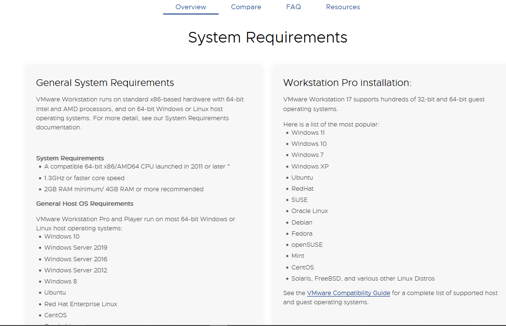

# Windows Server 2022 Prerequisites

Installing a Windows Server is a crucial procedure and one cannot afford mistakes. This would lead to flaws building into flaws leaving many services vulnerable. To avoid this, we need to ensure we meet all the set prerequisites.\
This article explains the prerequisites for installing a virtual instance of Windows Server 2022. Also, we will see where to download the required components.\
We need the following to be ready:

* Vmware Workstation (Player/Pro)
* Windows Server 2022
* Host machine with the following specifications
  * RAM: Atleast 512MB
  * Storage: A minimum of 32GB
  * Processor: 1.4 GHz 64-bit
  * Network Adapter: Ethernet adapter

## Downloading WIndows Server 2022

We can get the Windows Server 2022 from the Microsoft's official evaluation center [here](https://www.microsoft.com/en-us/evalcenter/evaluate-windows-server-2022).

The precise steps are as follows:\
1\. Go to the Windows Server 2022 evaluation page.\
2\. Click on the “Download the ISO” button.\
3\. Fill in your information in the form and click “Download”.

4. On the next page, select “Windows Server 2022 Standard” or “Windows Server 2022 Datacenter” based on your preference. In this case, we will go with Windows Server 2022 Standard

\
5\. Click the “Confirm” button. The ISO download will now start.

## Downloading VMware Workstation

This is straight forward:

1. Go to their [official website](https://www.vmware.com/products/workstation-pro.html)
2. You can either buy or download a trial version\
   
3. Consider the system requirements\
   

After the download is complete, follow the prompts to install and you are ready to go.

From here we can proceed to install our Windows Server 2022.\
See our next [article](2023-12-17-server-prequisites.md)
