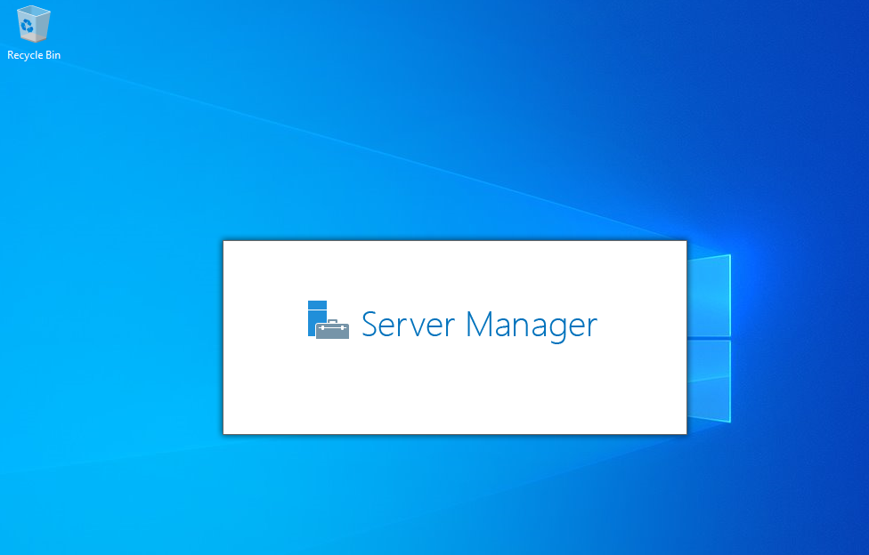

# Windows Server 2022

## Installing Windows Server 2022 Guide

In this article, we will cover how to install a virtual instance of Windows server 2022.\
All the requirements for the set-up are:

* VMWARE WORKSTATION(player/pro)
* WINDOWS SERVER 2022 ISO
* A minimum of 512MB RAM
* A minimum of 32GB storage
* 1.4GHz or higher processor

For all the prerequisites, refer to [this](2023-12-17-server2022.md) article.

**Step 1: Creating the Virtual Machine**

Select 'Create New Virtual Machine' as shown below(For this setup, I am using VMware workstation pro)

From the available configuration options, we choose Typical which entails most of the recommended default settings.\

Select 'I will install the operating system later'. This option will quicken the installation process\

Since we are installing a Windows server, select the Microsoft Windows option\

Supply the preffered name for the server and select the preferred storage location and click Next

For the disk capacity, store virtual disk as a single file.\

At this point, the set up is complete. Click Finish to proceed to the next level. If you need to make any changes, click on Customize Hardware.\

**Step 2: Installing the Server**

Our virtual machine is ready and all is left is to install the iso image.\
Click on the CD/DVD(SATA), in the pop-up window, select the option to use iso image file and browse to the file location\

Go on and power on the virtual machine

Immediately you'll be presented with a request to press any key to boot from CD. Quickly press any key

Set the Time and Currency format and Keyboard tye and click next\
Proceed through installation prompts

Crucial! We have the option to administer the server in graphical user interface mode or through the command line interface. Each of the options has the Standard Evaluation OS and Datacenter Evaluation OS. In this example, we choose the Standard Evaluation with Desktop Experience.\

Read! and Accept the license agreement and click Next to proceed.\

We choose the Custome installation type since it is a fresh install as compared to the Upgrade option.\

In the proceeding step, choose the installation drive and click Next after which the installation begins.\
Once done installing and setting up all the features, the VM reboots and prompts for creating the Administrator account. Supply a strong password and hit Enter.\

The installation is complete. Hit CTRL+ALT+DELETE to bring up the login page. Use the previously set credentials to login.

## Summary

In this post, we covered how to install a Windows server on a vmware workstation. Moving forward, we will customize the server to emulate a real production environment.
