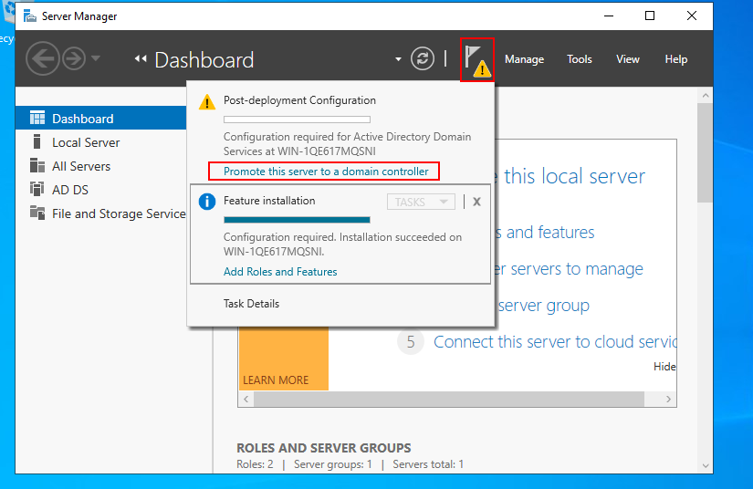

# How to create an AD Forest

## Installing Active Directory Forest

The first thing that comes up when we boot our server is the server manager. From here we are able to perform multiple administration tasks and setups.\
Let us install our active directory forest. First, click on _Add roles and Features_

Read the instructions under _Before you begin_ section then proceed to Installation type. Here, we need a Role-based or feature-based installations

Next confirm that the IP address corresponds to the static IP assigned earlier.

In the _Server Roles_ section, click to check the _Active Directory Domain Service_ checkbox. The pop-up that appears shows the features that are required for Active Directory Domain Services. Click _Add Features_.

On the next window, select the features that will be installed. For this setup, we will go with the default selection.

Continue and click _Next_

Confirm the selected settings and features and click _Install_

After a short while, the installation will be complete and a message for us that _'Configuration is required'_. Hit close

In the next window, we can see a warning sign. Click on it and select _Promote this server to a domain controller_.

It is at this poit where we add a new forest. If a forest already exists, you can either add a domain controller to an existing domain or add it to an existing forest.\
After checking the _Add a new forest_ radio button, go on and supply a root domain name. **NOTE** The root domain name cannot be changed afterwards. Ensure you give a domain name that is publicly available.

In the next window, select the highest forest functional level. As per now, we go with Windows server 2016. Ensure that the DNS checkbox is checked.

Ignore the error that shows up and click next.

The Netbios name will automatically be picked from the root domain name. It is a good practice to maintain it as so to avoid conflict.

Select the preferred database and log file storage location.

Review your selections and proceed to the next section.

We get a confirmation that all prerequisites checks are passed. Now all that is left is installation. Hit the _Install_ button.

After the installation, the server will automatically restart and we notice that the username has the dommain name.

From the server manager, click on the _Tools_ menu, from the dropdown, select _Active Directory Users and Computers_

Our forest is ready with the default OUs.

## Summary

In this article, we covered how to install an Active Directory Forest step-by-step.\
That was a success. In the coming articles, I will publish amazing content about how to perform other setups while also create some users and join some computers to the domain.
