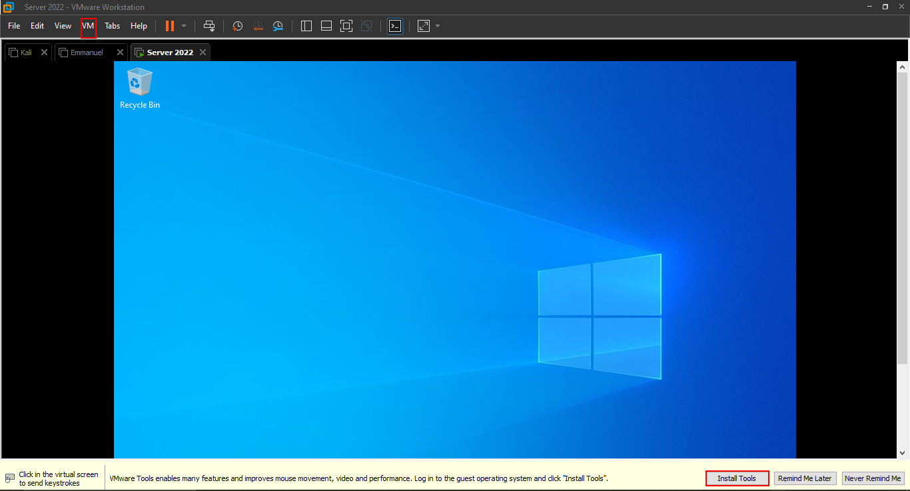

# AD Forest Prerequisites

## Installing VMWare Tools

We are going to do alot of configuration in our server and we need to ensure that we have a good environment. From where we left in our last article, where we installed the server 2022, we can notice the display does not fit the full screen as usual. This is because in our VM, we don't have most of the required drivers.\
Solution: Since we are running the server in VMWare, all we need is to install the VMWare tools.\
A pop-up at the bottom of our display gives us the option to install tools. This propmt can also be accessed from the **VM** tab button

After clicking on it, you'll realize that a new disk drive appears in the file explorer. This is the disk with all the tools.\
Right-click and select _Install or run program from your media_

This will bring a pop-up prompting us to select the setup type. For this exercise, we will use the _Typical_ option. However, you can also select _Complete_ or _Custom_ based on your needs.\
Click _Next_

Finally click _Install_

Within no time, we get a full screen display.\
Once done, we are prompted to restart our server. This will make sure that all changes are appplied successfully.\
That's it for the VMware tools.

To setup our Active Directory environment, we need to change our network settings and assign our server a static IP address.\
To do this, Open _Control Panel_ and navigate as shown in the below path. i.e. Control Panel > Network and Internet > Network Connections.\
Right-click on the _Ethernet0_ and select _properties_ or click on _Change settings of the connection_ tab button.\
Select _Use the following IP address_ checkbox, assign the desired IP address that is not in use by any other machine. Also specify the subnet mask and the default gateway.(To get your default gateway, open CMD and type _ipconfig /all_)\
For the DNS server, we can set a public server for now.(We will change this setting once we set up our DNS server)

Now with these settings, we are ready to setup and install our Active Directory environment.

## Summary

In this article,

> we covered how to install the VMware Tools in Windows Server 2022\
> We changed the network settings and assigned a static IP address to our server.\
> In our [next](2023-12-31-vmwaretools.md) article, we will cover how to setup and install an Active Directory Forest.
