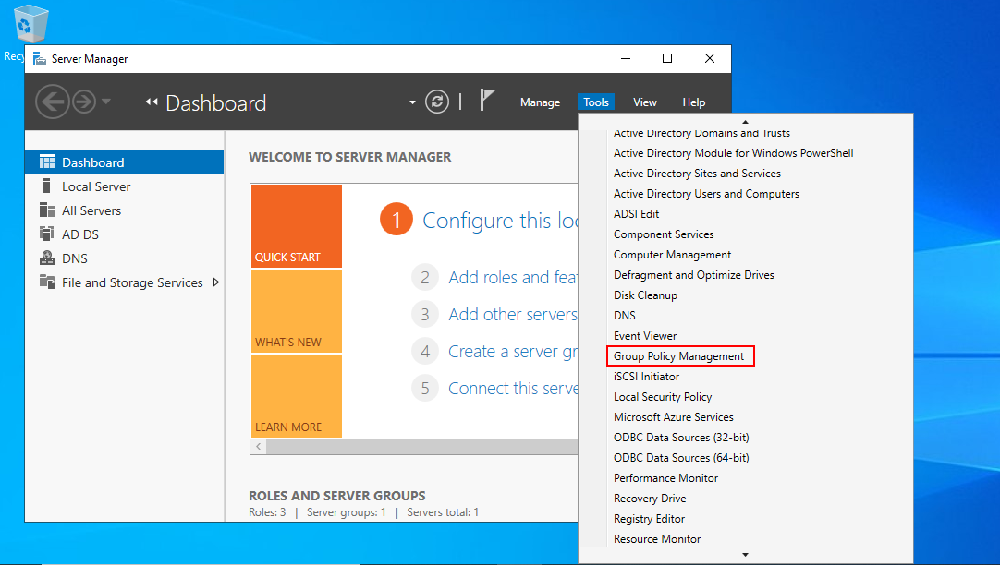
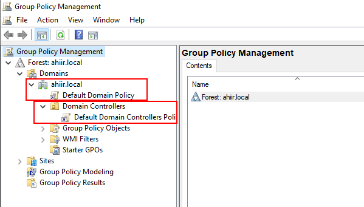
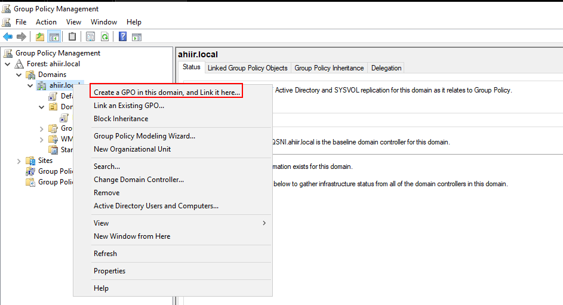
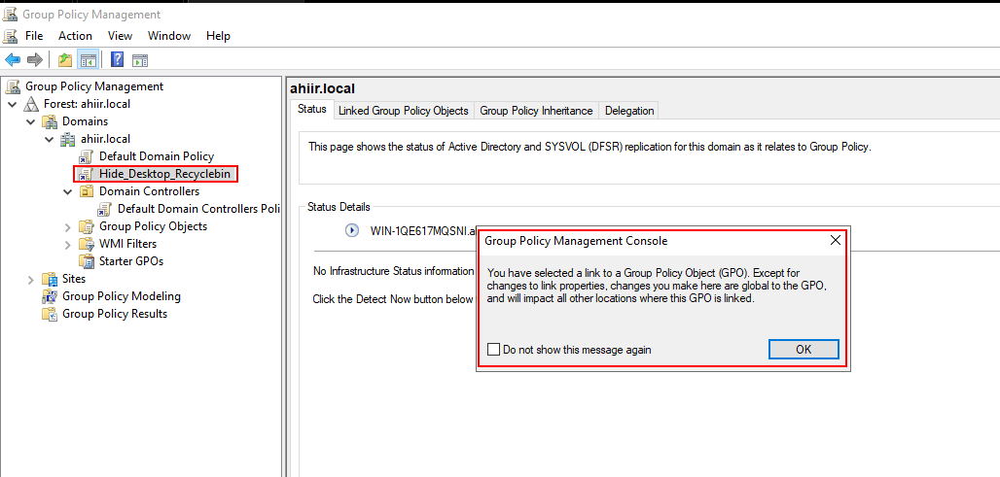
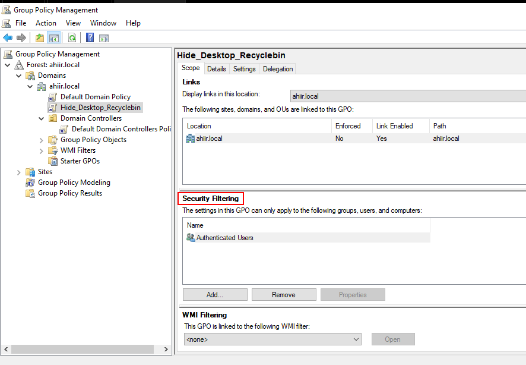
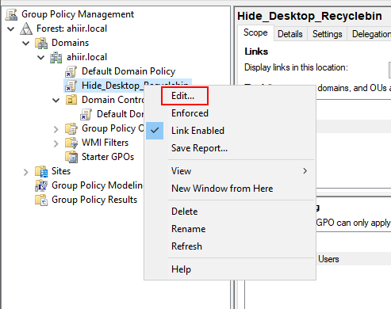
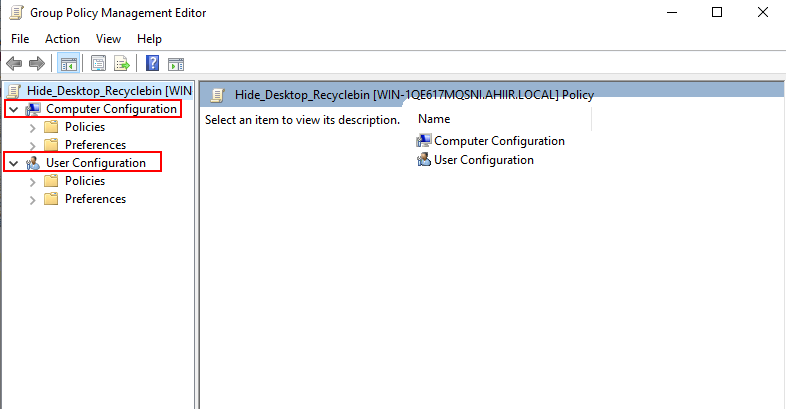
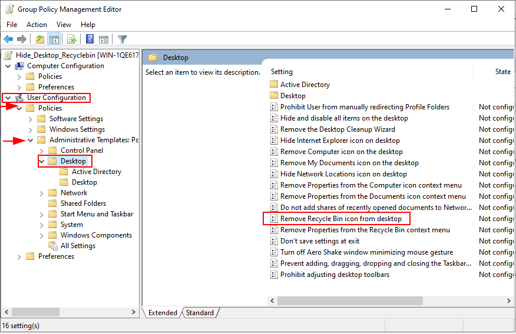
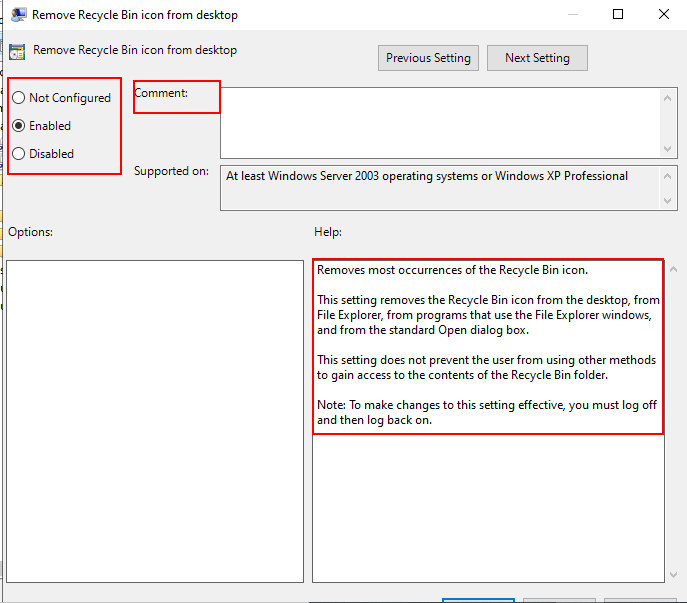
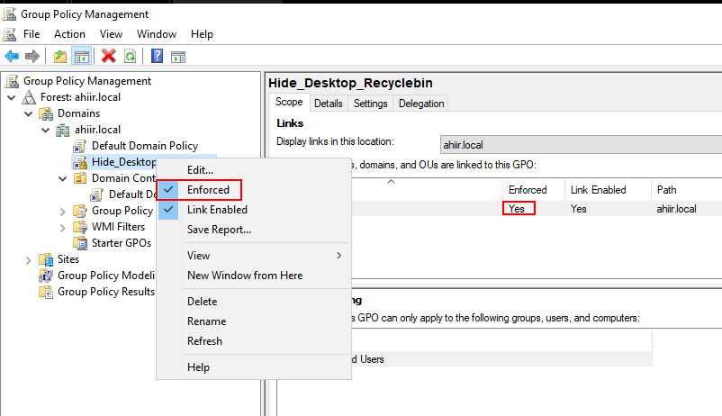

# Hide Recyclebin Icon using GPO

## Hiding the Recycle Bin Icon Using a Group Policy Object

Having seen the power of group policy objects in the [previous](2024-01-08-gpo-hands-on.md) article, let us see how to practically create and enforce one.\
In the Windows Server, open _Group Policy Management_ from the Tools tab.

As shown below, by default the Windows server comes with a default domain policy linked to the root of the active directory forest and applies to all domain controllers and their children.

For this example, we want our GPO to apply everywhere, hence, we will link it to the forest. Right-click on the forest and select _Create a GPO in this domain and link it here_. This will open a pop-up for naming the GPO. I will name mine as per its purpose

We can now see our new GPO named _Hide\_Desktop\_Recyclebin_. Upon double-clicking it, a pop-up comes up confirming that the GPO will apply globally.

From the main panel, we can see more settings and features related to this new GPO. Under the _Scope_ tab, we can confirm that our GPO will apply globally to the Active Directory forest and enforcement status. From this window, we can also filter the GPO to apply to specific domain users.

Right-click on the GPO and select _Edit_. This will open up the Group Policy Management Editor.

From the editor, we can see the two available categories upon which we can make our configuration. In this example, we will modify User Configuration.

Expand the User Configuration to reveal policy settings for users. Further, expand Administrative Templates Policies to reveal more settings. Click on the Desktop folder. This opens up the settings and their configuration state on the right panel. Double-click on the _Remove Recycle Bin icon from desktop_. This opens up further settings for the specific setting.

Here we need to toggle the _Enabled_ radio button. Also, you can add a comment on the text box provided. Moreover, at the right-end of the window, there is a concise explanation of this setting. Once enabling the setting, click on _Apply_ and _Ok_

All that is left now is to enforce the GPO. Right-click on it and check the _Enforced_ setting.

This GPO will apply to users joined in the domain. To effect this quickly,on clients computers open the command prompt with administrative rights and type the command _gpupdate /force_.

## Summary

Upon successfully, completing these steps, the Recycle Bin will be hidden from the desktop. This is just a simple example of how to configure a group policy object. Before implementing this to a production environment, make sure you thoroughly test the GPO in a non-production environment to ensure the required settings are effectively applied.
