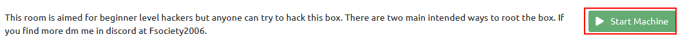
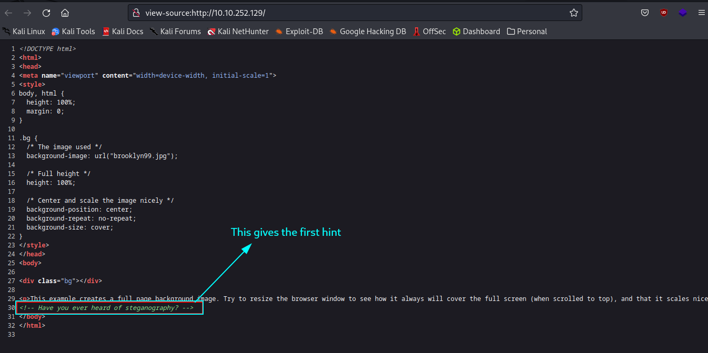
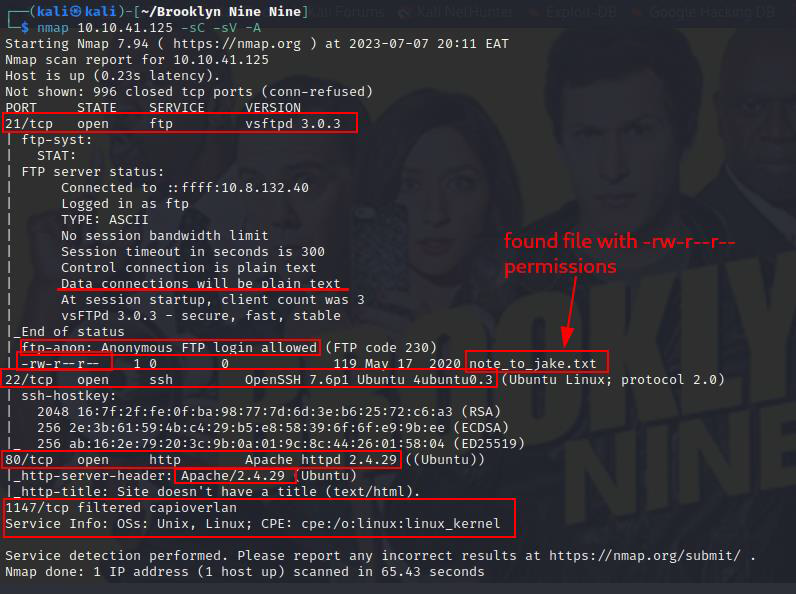
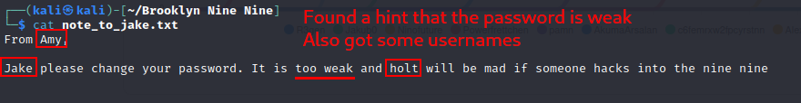
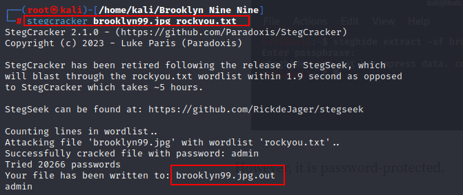
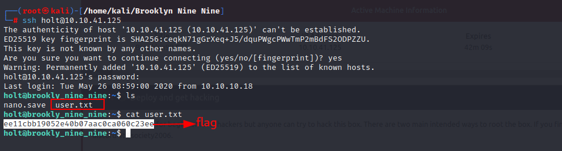
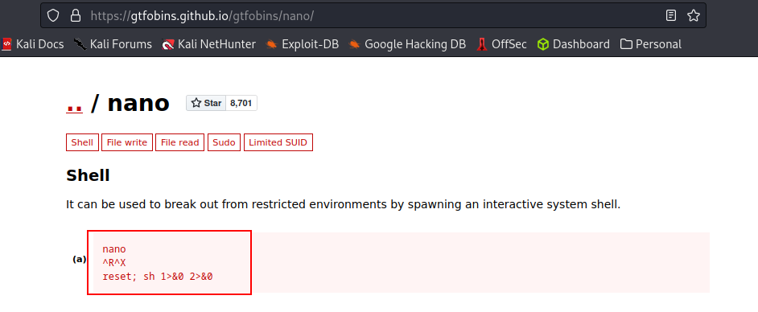
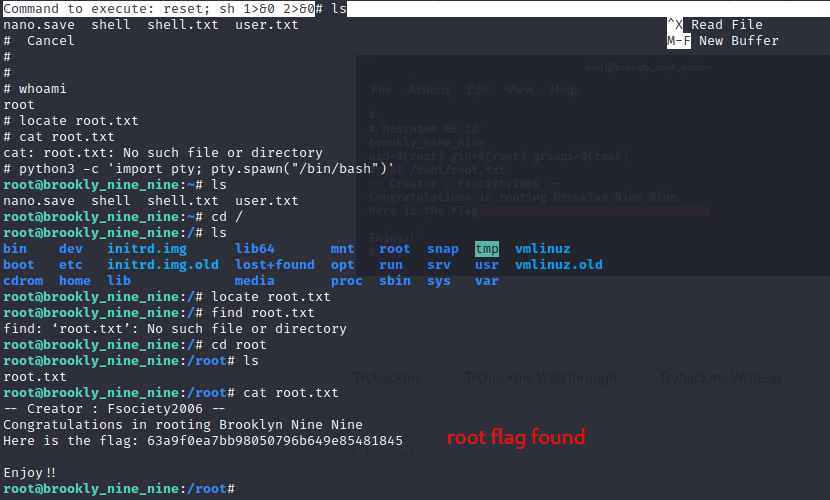

# Brooklyn Nine Nine

\
From the famous comedy show Brooklyn Nine-Nine comes a very sweet challenge dubbed by the same name. This is a beginner level CTF at [TryHackMe](https://tryhackme.com/room/brooklynninenine) that aims to improve the basic pentesting skills.

Here comes my walkthrough.\
Go ahead and start the Machine.\
\
Starting from the basics, hit that CTRL + U and view the source code. As highlighted, we see our first hint. Steganography!

_Steganography is the art of concealing information within non-text data like images._

That being discovered, let's save the background photo and see if there's more within it.\


Let us now do some Nmap scanning and see what ports are open and ideally the services running on them.\
A very basic scan gives us three ports and their services, 21 - FTP, 22 - SSH, 80 - HTTP\
Interestingly, anonymous login is allowed on port 21 and there is a note to Jake.\
Let us go for the hanging fruits first. FTP!\
\
The fruits are indeed sweet, we already know that a weak password is in use.\
Time for Hydra? Well, Not yet. Let us focus on the hint we found.\
Another tool - Stegcracker comes in handy. Using this tool we are able to extract any information embedded within the image.\
This is not straight forward as the information is password protected. We have to put in some work and bruteforce using the wordlist **rockyou.txt**\
That was successful. We have creds.

It is time to explore port 22. SSH.\
We have our user flag 💪

Now we have a foothold and we need to escalate the privileges inorder to retrieve the root's flag.\
Issuing the command `sudo -l` shows that Holt can run /bin/nano without a password.\
[GTFO Bin](https://gtfobins.github.io/gtfobins/nano/) comes in handy here.\


Running the payload lands us in root's paradise. Syntax:

```
nano
^R^X
rest; sh 1>&0 2>&0
```



To make the shell more interactive, we use the payload `python3 -c 'import pty; pty.spawn("/bin/bash")'`. This gives us a bash shell.

The flag is in the root's directory

That was fun!
