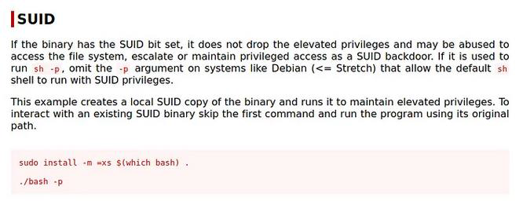

# Overpass 2 - Hacked

.png>)

This is the second room in a series of three Overpass rooms i.e [Overpass](https://tryhackme.com/room/overpass), [Overpass 2 - Hacked](https://tryhackme.com/room/overpass2hacked), and [Overpass 3 - Hosting](https://tryhackme.com/room/overpass3hosting). In this room, the main focus area is Network forensics where we are tasked with investigating a network capture file(attached) and reveal how **Overpass** got hacked. Below is the scenario..

_Overpass has been hacked! The SOC team (Paradox, congratulations on the promotion) noticed suspicious activity on a late night shift while looking at shibes, and managed to capture packets as the attack happened._

_Can you work out how the attacker got in, and hack your way back into Overpass' production server?_

### Task 1: Forensics - Analyze the PCAP file

We will use Wireshark - a network protocol analyzer and capture tool - to open the pcap file.

Q1.**What was the URL of the page they used to upload a reverse shell?**

Since we are looking for a URL, we use 'http' filter and analyze the first GET request packet.


_Answer: /development/_

Q2. **What payload did the attacker use to gain access?**\
Let us analyze the POST request.\
We can see that the attacker uploaded a reverse shell payload that had a netcat listener defined.


Q3. **What password did the attacker use to privesc?**\
We are given a hint that Netcat communication is in cleartext. Following this, let us filter for the port specified in the reverse shell payload.

_Answer: whenevernoteartinstant_

Q4. **How did the attacker establish persistence?**\
Looking keenly, we can see that the attacker deployed a backdoor to maintain persistence


_Answer: https://github.com/NinjaJc01/ssh-backdoor_

Q5. **Using the fasttrack wordlist, how many of the system passwords were crackable?**\
We noticed some password hashes in the network capture. Let us save these in a text document as passhash.txt\
To crack the hashes, We will use **John The Ripper** and issue our hashes. Syntax: _john --wordlist=fasttrack.txt passhash.txt_

_Answer: 4_

### Task 2: Research - Analyse the code

Now that you've found the code for the backdoor, it's time to analyse it.\
Q1. **What's the default hash for the backdoor?**\
We have the URL to the backdoor the attacker used. Now what?\
First, let us clone into the into repo. `git clone https://github.com/NinjaJc01/ssh-backdoor`\
Now let us read the code in the main.go file. As shown below, the default hash for the backdoor is declared as a variable


_Answer: bdd04d9bb7621687f5df9001f5098eb22bf19eac4c2c30b6f23efed4d24807277d0f8bfccb9e77659103d78c56e66d2d7d8391dfc885d0e9b68acd01fc2170e3_

Q2. **What's the hardcoded salt for the backdoor?**\
Scrolling further, we find the function that handles the password and the salt


_Answer: 1c362db832f3f864c8c2fe05f2002a05_

Q3. **What was the hash that the attacker used? - go back to the PCAP for this!**\
The attacker was well organized. He used a different hash for authentication. To see this, let us go back to the PCAP file and reanalyze the packet again


_Answer: 6d05358f090eea56a238af02e47d44ee5489d234810ef6240280857ec69712a3e5e370b8a41899d0196ade16c0d54327c5654019292cbfe0b5e98ad1fec71bed_

Q4. **Crack the hash using rockyou and a cracking tool of your choice. What's the password?**\
Now we have the hash and the salt. We will definitely crack this. First, let's know the hash type. Using [Hash Analyzer](https://www.tunnelsup.com/hash-analyzer/), we can see it is a SHA2-512

<br>

Now, let us visit the Hashcat wiki and learn the syntax


We save our hash and salt in a text document using the format _$pass.$salt_ and proceed to crack the password.

```
hashcat -m 1710 -a 0 /home/kali/OSINT/rockyou.txt hash.txt
```


_Answer: november16_

### Task 3: Attack - Get back in!

The progress is good so far. Let us see what we required of in this task. Attached is a production server and we have the creds.

_Now that the incident is investigated, Paradox needs someone to take control of the Overpass production server again._

_There's flags on the box that Overpass can't afford to lose by formatting the server!_

Q1. **The attacker defaced the website. What message did they leave as a heading?**\
We boot the server and open an interface on the browser. As we can see, the attacker left some message for us.

\


_Answer: H4ck3d by CooctusClan_

Q2. **Using the information you've found previously, hack your way back in!**\
We have all that we need. Let's do this

Q3. **What's the user flag?**\
The user flag was in the home directory. To retrieve it we SSH into the machine

```
ssh -oHostKeyalgorithms=+ssh-rsa james@10.10.115.194 -p 2222 #password is november16
```


_Answer: thm{d119b4fa8c497ddb0525f7ad200e6567}_

Q4. **What's the root flag?**\
Listing the content of the directory, we notice a hidden bash file that is not executable.

<br>

Dead END? NO, NEVER. Let us do some research.\
[GTFO Bin Payloads](https://gtfobins.github.io/gtfobins/python/) is our rescue

<br>

Excellent! Privilege escalated


_Answer: thm{d53b2684f169360bb9606c333873144d}_

That's it


## SUMMARY

What did we learn and what skills did we gain? The following were the key takeaways

1. Analyzing a PCAP file using Wireshark
2. Cracking password hashes using JOhn The Ripper and Hash Cat
3. Privilege escalation tactic leveraging Set User ID (SUID)

Next, I will be posting a walkthrough of Overpass 3 - Hosting.
