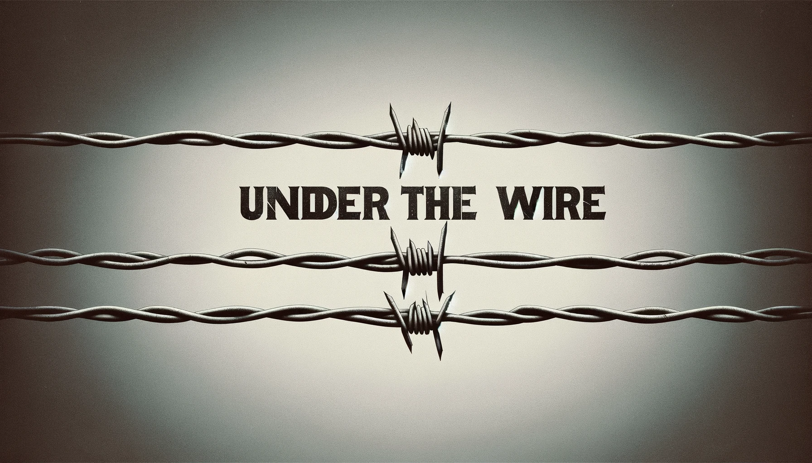
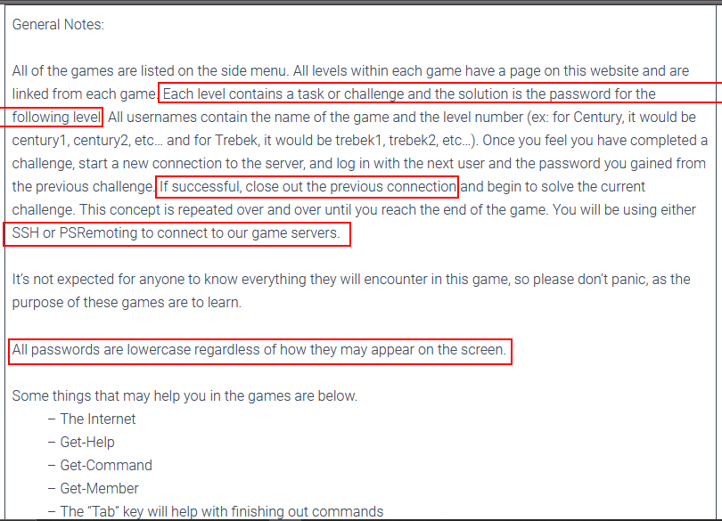
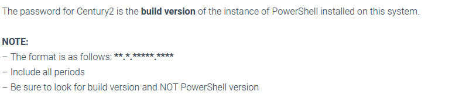
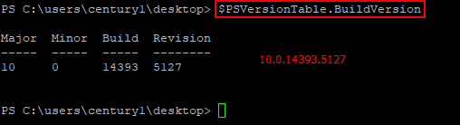
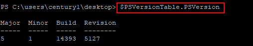
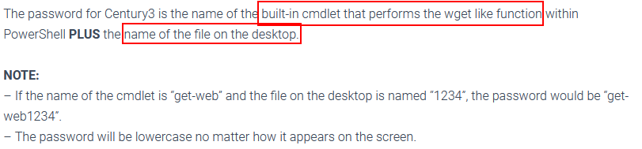
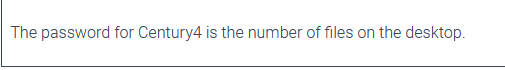
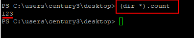

# Century 1 - 3



\
Without much ado, Lets jump right in.\
Head over to [https://underthewire.tech/wargames](https://underthewire.tech/wargames) where you'll find some instructions as stressed below.\
\
For this article, I will be using **PUTTY** to SSH to the servers. Get it [here](2023-12-24-under_the_wire.md)

### Century 1

This is the beginning point. We need to ssh to the server _century.underthewire.tech_ and find the level goal.\
Username: century1\
Password: century1\
So the goal is to obtain the build version of the powershell instance installed.\
\
We use the command below

```powershell
$PSVersionTable.BuildVersion 

```

\
If we were to get the powershell version, we would have used the command below

```powershell
$PSVersionTable.PSVersion 

```

\
So the Password for century 2 is _**10.0.14393.5127**_

### Century 2

Host → century.underthewire.tech\
username → century2\
password → 10.0.14393.5127\
Goal:\
\
Solution:\
Name of the file → 443\
The Name of the built-in cmdlet that performs the wget like functions within Powershell is _Invoke-WebRequest_\
So the Solution will be → invoke-webrequest443

So the password for century 3 is _**invoke-webrequest443**_

### Century 3

Host → century.underthewire.tech\
username → century3\
password → invoke-webrequest443

Goal: → Getting the number of files on the desktop\
\
To obtain this, we need the Powershell command equivalent for `wc -l` in Linux.\
Solution: We use the command while in the desktop directory

```powershell
(dir *).count
```

\
And the password for century 4 is _**123**_

This is fun, right?\
Let us catch up in my next article for century 4 through century 7.
