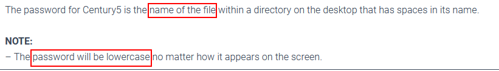
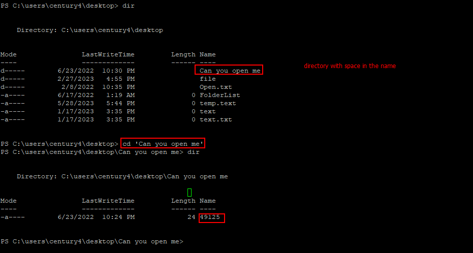
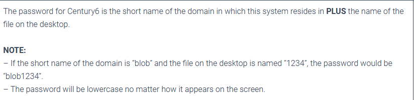
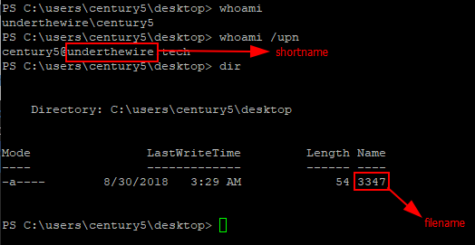
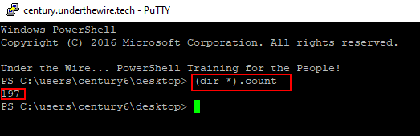
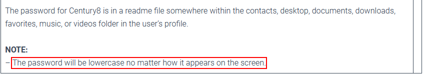
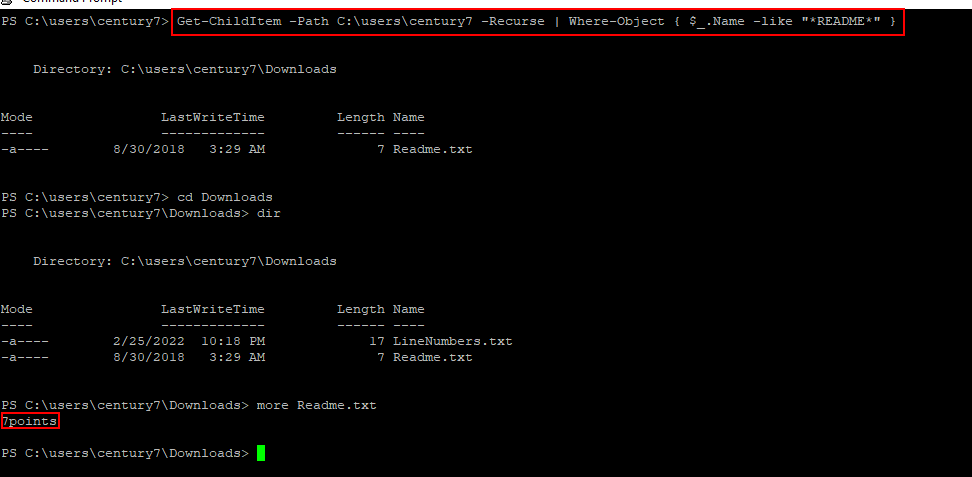
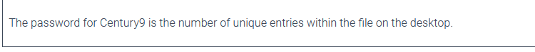
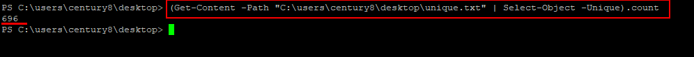

# Century 4-8

In this article, we will cover five levels. i.e century 4 thru' century 8.\
Let's get right in...

### Century 4

_Host → century.underthewire.tech_\
_username → century4_\
_password → 123_

**Goal: → to enter into a directory with a space in the name**



We know that within Windows OS, we can easily have a directory name with spaces in it. But how do we actually change into the directory from the commandline? The first attempt would be straight forward, use _cd directory name_. This will however not work as expected due to the space after the first word. To do this, we need to use the ' ' to wrap and treat the directory name as a single word.



And the password for century 5 is: _**49125**_

### Century 5

Host → century.underthewire.tech\
username → century5\
password → 49125

Goal: → To retrieve the domain name\




### Century 6

Host → century.underthewire.tech\
username → century6\
password → underthewire3347

Goal: → To count the number of folders/directories



### Century 7

Host: century.underthewire.tech\
username: century7\
password: 197

Goal:\


Solution

```powershell
Get-ChildItem -Path C:\users\century7 -Recurse | Where-Object { $_.Name -like “*README*” }
```



### Century 8

Host: century.underthewire.tech\
username: century8\
password: 7points

Goal: Getting the unique entries within the file



Solution

```powershell
(Get-Content -Path “C:\users\century8\desktop\unique.txt” | Select-Object -Unique).count
```


