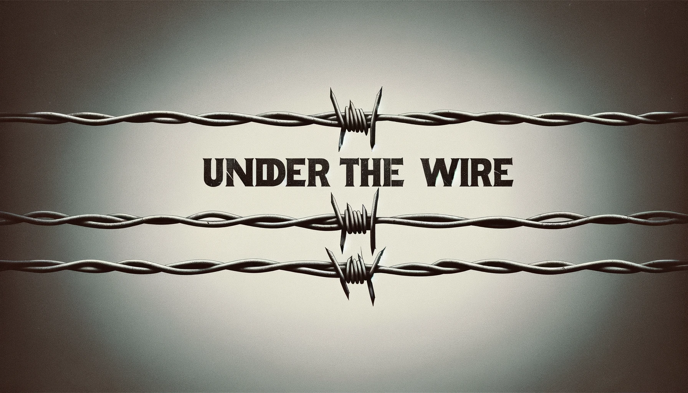

# UnderTheWire

<figure><figcaption></figcaption></figure>

UnderTheWire is a wargame designed to help security professionals (or anyone interested) learn and practice using the Windows Powershell. The complexity of the challenges graduate at each level (century).
